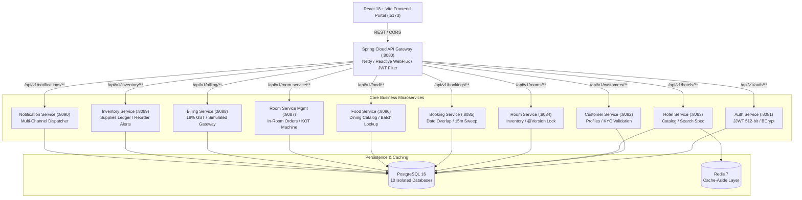
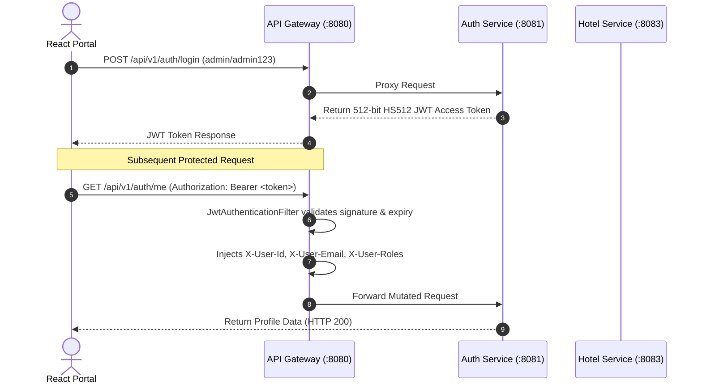

# Grand Luxe Hospitality Management System — Architecture Reference Manual

---

## 1. System Overview

The **Grand Luxe Hospitality Management System (HMS)** is an enterprise-grade, microservices-based hotel management, reservation, in-room dining, and operations platform designed to meet the rigorous design standards expected of a **3–4+ years experienced Java Backend Developer**.

The system adheres strictly to the **Database-per-Service pattern**, **Perimeter Edge Security (API Gateway)**, **Cache-Aside pattern**, and **Optimistic Concurrency Control**.

---

## 2. Microservices Topology

---

## 3. Database-per-Service Mapping

To guarantee loose coupling and prevent cross-domain database contention, each microservice owns its private PostgreSQL database:

| Microservice | Port | PostgreSQL Database | Core Entities & Tables |
|---|---|---|---|
| **auth-service** | 8081 | `hms_auth_db` | `users`, `roles`, `user_roles` |
| **customer-service** | 8082 | `hms_customer_db` | `customers` |
| **hotel-service** | 8083 | `hms_hotel_db` | `hotels` + Redis cache `hotel_cache` |
| **room-service** | 8084 | `hms_room_db` | `rooms`, `room_status_logs` |
| **booking-service** | 8085 | `hms_booking_db` | `bookings` |
| **food-service** | 8086 | `hms_food_db` | `food_items` |
| **room-service-management** | 8087 | `hms_rsm_db` | `room_service_orders`, `room_service_order_items` |
| **billing-service** | 8088 | `hms_billing_db` | `invoices`, `payments` |
| **inventory-service** | 8089 | `hms_inventory_db` | `inventory_items`, `stock_movement_logs` |
| **notification-service** | 8090 | `hms_notification_db` | `notification_logs` |

---

## 4. Inter-Service Communication Patterns

### A. Synchronous (OpenFeign + Apache HttpClient 5)
Declarative REST clients are used for strong real-time operational validation:
1. **Room $\to$ Hotel**: Validates that target hotel is active prior to room creation.
2. **Food $\to$ Hotel**: Validates property existence before menu item creation.
3. **Room Service Mgmt $\to$ Food**: Executes batch resolution (`POST /api/v1/food/batch`) to validate availability and fetch frozen unit prices in **a single network round-trip**.
4. **Room Service Mgmt $\to$ Booking**: Validates that the guest has an active booking.
5. **Billing $\to$ Booking**: Triggers booking confirmation upon payment success.

### B. Asynchronous (Kafka / Event Bus)
For decoupled side-effects:
1. `hms.booking.events`: Emitted when a booking is created, confirmed, or expired. Consumed by `notification-service` to dispatch confirmation emails/SMS.
2. `hms.payment.events`: Emitted when payment succeeds or fails.

---

## 5. Security & Edge Authentication

1. **Whitelisting**: `/api/v1/auth/**`, public `GET /hotels`, `GET /rooms`, `GET /food`, and CORS `OPTIONS` bypass token verification.
2. **Perimeter Defense**: Protected requests missing a valid Bearer token are terminated at the Gateway with `HTTP 401 Unauthorized` without consuming downstream resources.
3. **Downstream Header Injection**: The Gateway verifies the JWT once, unpacks claims, and injects trusted headers (`X-User-Id`, `X-User-Email`, `X-User-Roles`) to downstream services.

---

## 6. Concurrency, Locking & Data Consistency

### A. Double-Booking Prevention Engine
To prevent overlapping room reservations, `booking-service` runs a mathematical interval query inside a `@Transactional` block:
$$\text{checkIn} < \text{:newCheckOut} \quad \text{AND} \quad \text{checkOut} > \text{:newCheckIn}$$
If any active booking (`CONFIRMED` or `PENDING_PAYMENT`) overlaps, the booking is rejected immediately with `HTTP 409 Conflict`.

### B. Optimistic Locking (`@Version`)
Implemented across high-contention entities:
- `Room`: Prevents two desk clerks from concurrently booking the same room.
- `FoodItem`: Prevents concurrent price/availability corruption.
- `InventoryItem`: Protects stock decrement race conditions.
If a concurrent update occurs, Hibernate throws `ObjectOptimisticLockingFailureException`, which is mapped to `HTTP 409 Conflict`.

### C. 15-Minute Reservation Expiry Sweep Job
Reservations in `PENDING_PAYMENT` state have a 15-minute validity window. A Spring `@Scheduled(cron = "0 */1 * * * *")` background job runs every minute, cancels expired holds, and emits cancellation events to free up room availability.

---

## 7. High-Performance Caching (Redis 7)

`hotel-service` implements the **Cache-Aside pattern**:
1. `GET /api/v1/hotels/{id}` executes `@Cacheable(value = "hotel_cache", key = "#id")`.
2. On cache hit: Redis returns serialized JSON in `< 2ms` with zero database round-trips.
3. On cache miss: PostgreSQL is queried, and Redis is populated.
4. On `PUT /api/v1/hotels/{id}`: `@CacheEvict(value = "hotel_cache", key = "#id")` invalidates stale cache to maintain strict cache consistency.
