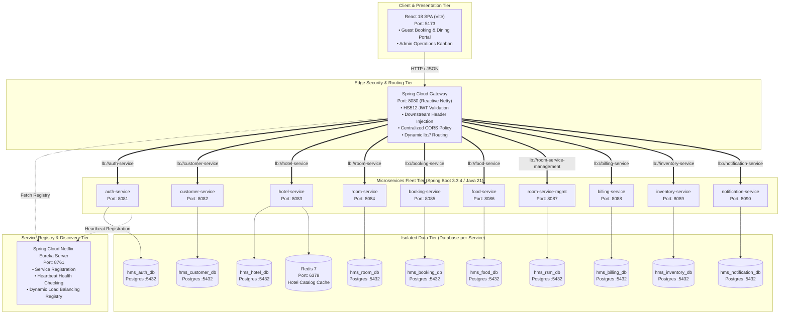
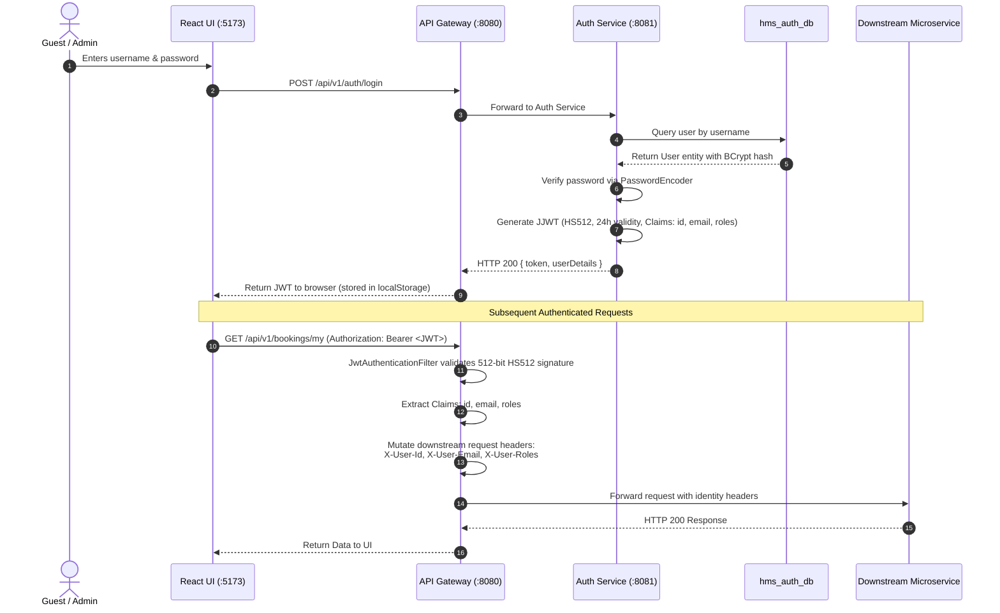
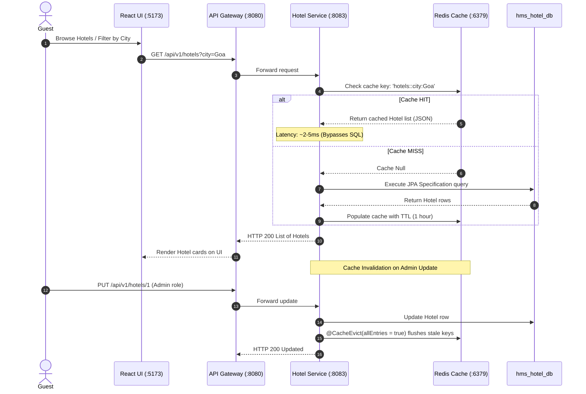
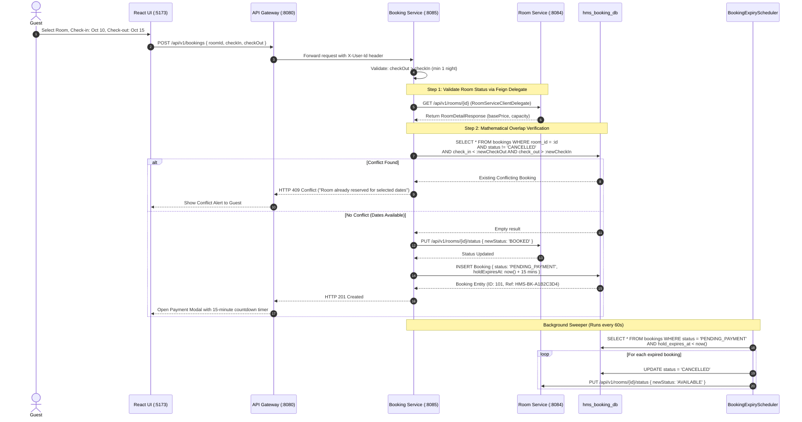
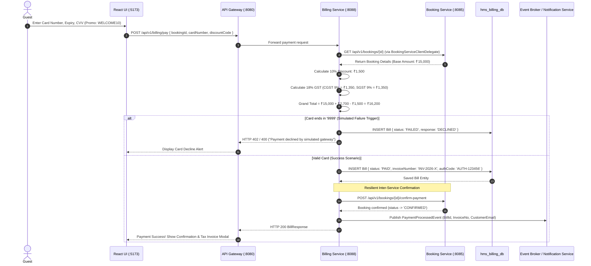
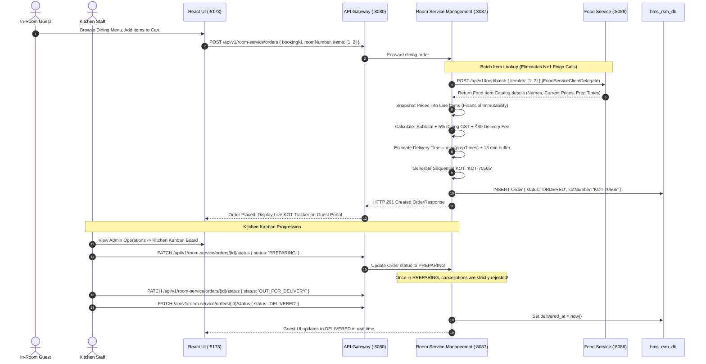
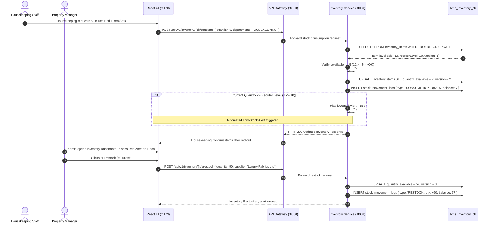
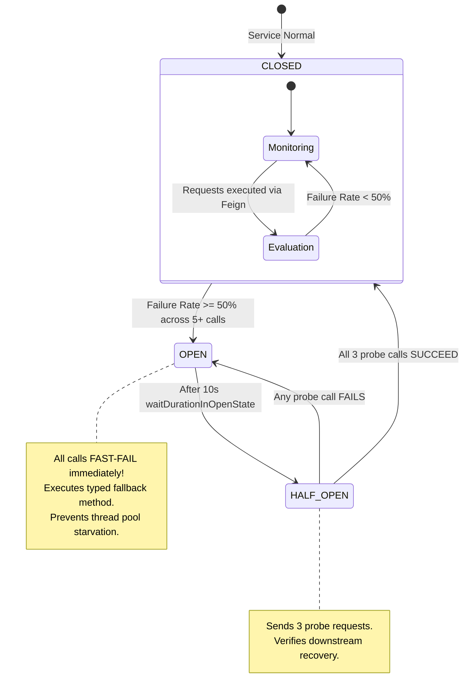

# High-Level Workflow Design (HWD) — Grand Luxe HMS
### Production-Grade Microservices Architecture System Workflow Document

---

## 1. System Vision & Architecture Overview

**Grand Luxe** is an enterprise-grade Hospitality Management System engineered using modern cloud-native Java patterns. The system is designed to simulate a real-world 5-star luxury hotel chain operating multiple properties, featuring real-time room reservations, billing & tax invoicing, in-room dining with live kitchen order tickets (KOT), staff inventory tracking, multi-channel guest notifications, and high-concurrency protection.

### Architectural Core Principles
1. **Database-per-Service**: Each microservice strictly owns its dedicated PostgreSQL 16 database. No cross-service database queries or joins are permitted.
2. **Dynamic Service Registry & Discovery**: Spring Cloud Netflix Eureka Server (port 8761) maintains active instance registries and heartbeats. API Gateway and OpenFeign route dynamically using `lb://<service-name>` virtual URIs.
3. **API Gateway as the Single Entry Point**: A Spring Cloud Gateway (Netty / Reactive WebFlux, port 8080) acts as the reverse proxy, validating 512-bit HS512 JWTs, dynamically resolving downstream instances from Eureka, and injecting downstream identity headers.
4. **Resilience & Fault Tolerance**: Synchronous inter-service calls (OpenFeign) are guarded by **Resilience4j Circuit Breakers**, **Exponential Backoff Retries**, and **Spring Boot Actuator** health telemetry.
5. **High Concurrency & Audit Integrity**: Concurrency conflicts are mitigated using mathematical date-overlap checks and JPA `@Version` optimistic locking. Audit logs record room status transitions and stock movements immutably.

---

## 2. High-Level Architecture Topology

---

## 3. Database-per-Service Mapping

| Microservice | Port | Database Name | Primary Domain Responsibility |
| :--- | :--- | :--- | :--- |
| **eureka-server** | `8761` | *In-Memory Registry* | Spring Cloud Netflix Eureka Discovery Server, dynamic service registration & heartbeat health tracking |
| **api-gateway** | `8080` | *None (Stateless)* | Netty reverse proxy, dynamic `lb://` route resolution, JWT auth filter, CORS |
| **auth-service** | `8081` | `hms_auth_db` | User credentials, BCrypt hashes, roles (`ROLE_CUSTOMER`, `ROLE_ADMIN`, `ROLE_STAFF`), JJWT token generator |
| **customer-service** | `8082` | `hms_customer_db` | Guest profiles, KYC document tracking, contact info, active status |
| **hotel-service** | `8083` | `hms_hotel_db` | Hotel property catalog, star ratings, amenities, Redis cache-aside |
| **room-service** | `8084` | `hms_room_db` | Room inventory, types (`DELUXE`, `SUITE`, `PRESIDENTIAL`), `@Version` locking, `RoomStatusLog` audit |
| **booking-service** | `8085` | `hms_booking_db` | Reservation state machine, date-overlap query, 15-min temporary holds, expiry scheduler |
| **food-service** | `8086` | `hms_food_db` | Dining catalog, dietary flags (`VEG`, `NON_VEG`, `JAIN`), batch item lookup |
| **room-service-management** | `8087` | `hms_rsm_db` | In-room dining orders, historical price snapshotting, KOT numbering, prep time tracking |
| **billing-service** | `8088` | `hms_billing_db` | Invoicing, 18% GST tax calculation (CGST 9% + SGST 9%), payment gateway simulation, card-failure triggers |
| **inventory-service** | `8089` | `hms_inventory_db` | Hotel assets (`LINEN`, `TOILETRIES`, `PANTRY`), immutable `StockMovementLog`, low-stock auto-alerts |
| **notification-service** | `8090` | `hms_notification_db` | Multi-channel dispatch (HTML email & SMS templates), dispatch audit log, async Kafka consumer |

---

## 4. End-to-End High-Level Workflows

### Workflow 1: Authentication & Token Propagation Flow

---

### Workflow 2: Hotel Discovery & Redis Cache-Aside Flow

---

### Workflow 3: Room Booking & Concurrency Control Flow

---

### Workflow 4: Billing, Tax Invoicing & Payment Simulation Flow

---

### Workflow 5: In-Room Dining & Kitchen Order Ticket (KOT) Flow

---

### Workflow 6: Hotel Inventory & Stock Replenishment Flow

---

## 5. Resilience & Fault Tolerance Architecture

Every synchronous inter-service OpenFeign communication path is wrapped by a **Resilience4j Circuit Breaker** and **Retry with Exponential Backoff** implemented via dedicated `@Component` client delegates.

---

## 6. Infrastructure Port Map

| Component | Port | Technology | Protocol / Format |
| :--- | :--- | :--- | :--- |
| **API Gateway** | `8080` | Spring Cloud Gateway (Netty) | HTTP / REST |
| **Auth Service** | `8081` | Spring Boot 3.3.4 (Tomcat) | HTTP / REST |
| **Customer Service** | `8082` | Spring Boot 3.3.4 (Tomcat) | HTTP / REST |
| **Hotel Service** | `8083` | Spring Boot 3.3.4 (Tomcat) | HTTP / REST |
| **Room Service** | `8084` | Spring Boot 3.3.4 (Tomcat) | HTTP / REST |
| **Booking Service** | `8085` | Spring Boot 3.3.4 (Tomcat) | HTTP / REST |
| **Food Service** | `8086` | Spring Boot 3.3.4 (Tomcat) | HTTP / REST |
| **Room Service Mgmt** | `8087` | Spring Boot 3.3.4 (Tomcat) | HTTP / REST |
| **Billing Service** | `8088` | Spring Boot 3.3.4 (Tomcat) | HTTP / REST |
| **Inventory Service** | `8089` | Spring Boot 3.3.4 (Tomcat) | HTTP / REST |
| **Notification Service** | `8090` | Spring Boot 3.3.4 (Tomcat) | HTTP / REST |
| **React UI** | `5173` | React 18 + Vite | HTTP / HTML / JS |
| **PostgreSQL Database** | `5432` | PostgreSQL 16 Alpine | JDBC (10 isolated schemas) |
| **Redis Cache** | `6379` | Redis 7 Alpine | RESP (Cache-Aside) |
