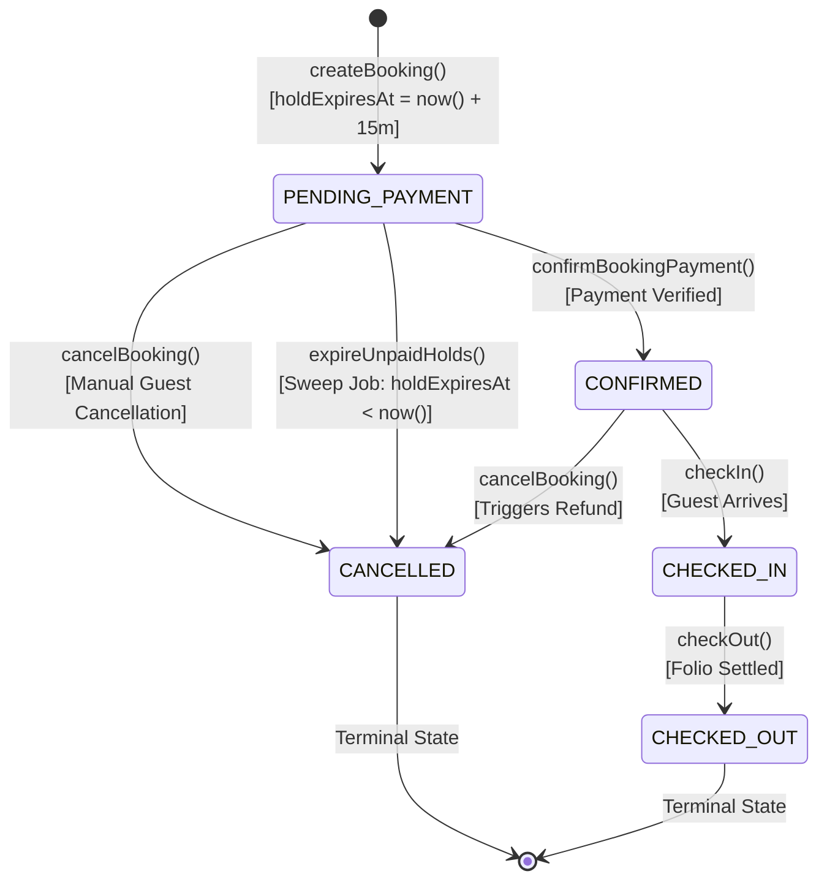
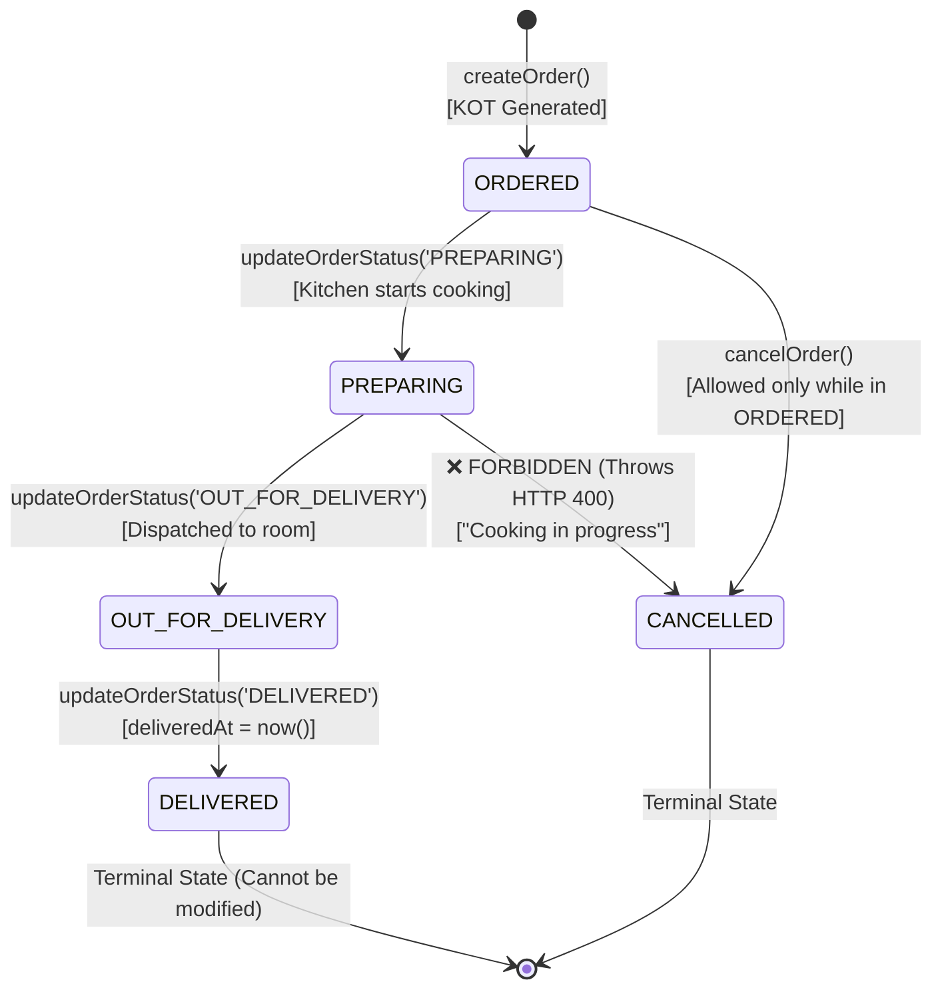
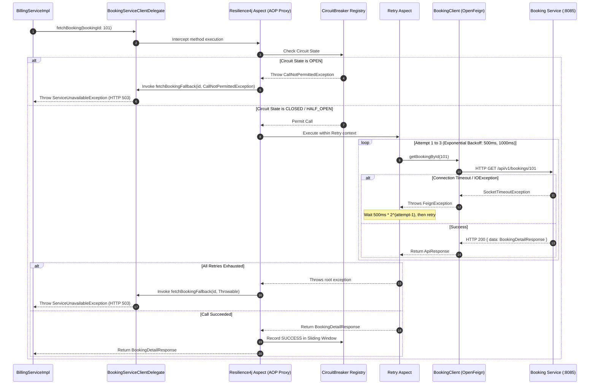

# Low-Level Workflow Design (LWD) — Grand Luxe HMS
### Detailed Component Specifications, ER Diagrams, State Machines & Algorithms

---

## 1. Low-Level Component Architecture & Design Patterns

Each Spring Boot microservice in the Hospitality Management System follows strict **Layered Clean Architecture**:

```
[HTTP Request from API Gateway :8080]
              │
              ▼
    ┌──────────────────┐
    │  @RestController │ ◄── Bean Validation (@Valid, @NotNull, @Size)
    └─────────┬────────┘
              │ Calls
              ▼
    ┌──────────────────┐
    │ @Component (Del) │ ◄── Resilient Delegate Wrapper (@CircuitBreaker, @Retry)
    └─────────┬────────┘
              │ Calls (OpenFeign / Internal)
              ▼
    ┌──────────────────┐
    │     @Service     │ ◄── Business Logic, State Machine Guards, Calculations
    └─────────┬────────┘
              │ Interacts with
              ▼
    ┌──────────────────┐
    │  @Repository     │ ◄── Spring Data JPA, Specifications, Native/JPQL Queries
    └─────────┬────────┘
              │ Reads/Writes
              ▼
    ┌──────────────────┐
    │     @Entity      │ ◄── JPA Entities, @Version Optimistic Locking, Enums
    └──────────────────┘
```

### Key Design Patterns Implemented

| Pattern | Code Location / Implementation | Purpose |
| :--- | :--- | :--- |
| **Delegate / Proxy Pattern** | `*ServiceClientDelegate.java` | Solves Spring AOP self-invocation gotcha; encapsulates `@CircuitBreaker` and `@Retry` aspects. |
| **Builder Pattern** | Lombok `@Builder` on all Entities & DTOs | Enables immutable, clean object construction without telescoping constructors. |
| **State Machine Pattern** | `BookingStatus`, `RoomServiceOrderStatus` | Enforces deterministic lifecycle transitions with strict guard conditions. |
| **Cache-Aside Pattern** | `HotelServiceImpl` + Redis `@Cacheable` | Cache lookup before SQL; cache invalidation via `@CacheEvict` on state change. |
| **Optimistic Concurrency Pattern** | `@Version private Long version;` on `Room`, `Bill`, `InventoryItem` | Prevents lost updates under high concurrency without pessimistic row locking. |
| **Specification Pattern** | `HotelSpecification.java`, `FoodSpecification.java` | Dynamic multi-criteria search filtering without query string concatenation. |

---

## 2. Complete Entity-Relationship Diagrams (ERD)

```mermaid
erDiagram
    %% Auth Service DB
    USERS ||--o{ USER_ROLES : has
    USERS {
        bigint id PK
        varchar username UK
        varchar password_hash
        varchar email UK
        boolean active
        timestamp created_at
    }
    USER_ROLES {
        bigint user_id FK
        varchar role
    }

    %% Customer Service DB
    CUSTOMERS {
        bigint id PK
        varchar full_name
        varchar email UK
        varchar phone
        varchar id_proof_type
        varchar id_proof_number
        boolean is_active
        timestamp created_at
    }

    %% Hotel Service DB
    HOTELS {
        bigint id PK
        varchar name
        varchar city
        varchar address
        int star_rating
        text description
        boolean is_active
        timestamp created_at
    }

    %% Room Service DB
    ROOMS ||--o{ ROOM_STATUS_LOGS : tracks
    ROOMS {
        bigint id PK
        bigint hotel_id
        varchar room_number
        varchar type
        varchar status
        numeric base_price
        int capacity
        int floor_number
        bigint version
    }
    ROOM_STATUS_LOGS {
        bigint id PK
        bigint room_id FK
        varchar previous_status
        varchar new_status
        varchar changed_by
        varchar reason
        timestamp changed_at
    }

    %% Booking Service DB
    BOOKINGS {
        bigint id PK
        varchar booking_reference UK
        bigint customer_id
        bigint room_id
        bigint hotel_id
        date check_in_date
        date check_out_date
        int number_of_nights
        int number_of_guests
        numeric total_amount
        varchar status
        varchar payment_status
        timestamp hold_expires_at
        bigint version
    }

    %% Food Service DB
    FOOD_ITEMS {
        bigint id PK
        bigint hotel_id
        varchar name
        varchar category
        varchar dietary_type
        numeric price
        int preparation_time_minutes
        boolean is_available
    }

    %% Room Service Management DB
    ROOM_SERVICE_ORDERS ||--|{ ROOM_SERVICE_ORDER_ITEMS : contains
    ROOM_SERVICE_ORDERS {
        bigint id PK
        varchar order_number UK
        varchar kot_number UK
        bigint booking_id
        bigint hotel_id
        bigint room_id
        varchar room_number
        varchar status
        numeric subtotal
        numeric tax_amount
        numeric delivery_fee
        numeric total_amount
        int estimated_delivery_minutes
        timestamp ordered_at
        timestamp delivered_at
        bigint version
    }
    ROOM_SERVICE_ORDER_ITEMS {
        bigint id PK
        bigint order_id FK
        bigint food_item_id
        varchar item_name
        numeric unit_price
        int quantity
        numeric total_price
        varchar notes
    }

    %% Billing Service DB
    BILLS {
        bigint id PK
        varchar invoice_number UK
        varchar transaction_reference UK
        bigint booking_id UK
        varchar booking_reference
        bigint customer_id
        bigint hotel_id
        numeric base_amount
        numeric tax_rate_percentage
        numeric tax_amount
        numeric discount_amount
        numeric total_amount
        varchar payment_method
        varchar status
        varchar payment_gateway_response
        timestamp paid_at
        timestamp refunded_at
        bigint version
    }

    %% Inventory Service DB
    INVENTORY_ITEMS ||--o{ STOCK_MOVEMENT_LOGS : records
    INVENTORY_ITEMS {
        bigint id PK
        bigint hotel_id
        varchar item_name
        varchar category
        int quantity_available
        int reorder_level
        varchar unit_of_measure
        bigint version
    }
    STOCK_MOVEMENT_LOGS {
        bigint id PK
        bigint item_id FK
        varchar movement_type
        int quantity_changed
        int balance_after
        varchar department
        varchar remarks
        timestamp recorded_at
    }

    %% Notification Service DB
    NOTIFICATION_LOGS {
        bigint id PK
        varchar channel
        varchar recipient
        varchar subject
        text message_body
        varchar status
        int retry_count
        timestamp sent_at
    }
```



---

## 3. Low-Level State Machines

### A. Booking Reservation State Machine



**Guard Conditions:**
1. An order in `CONFIRMED` cannot transition back to `PENDING_PAYMENT`.
2. When transitioning to `CANCELLED`, `RoomServiceClientDelegate.updateRoomStatus(roomId, 'AVAILABLE')` is executed to free the room hold immediately.

---

### B. Kitchen Order Ticket (KOT) State Machine



**Guard Conditions:**
1. Cancellation is strictly prohibited once the status reaches `PREPARING` because kitchen preparation cost is irreversible.
2. Valid transition sequence is linear: `ORDERED` -> `PREPARING` -> `OUT_FOR_DELIVERY` -> `DELIVERED`. Direct jump from `ORDERED` -> `DELIVERED` throws `BadRequestException`.

---

## 4. Algorithmic Deep Dives

### A. Mathematical Date Overlap Conflict Query

To guarantee that room $R$ is never double-booked, the query checks whether an existing reservation $[C_{in}^{exist}, C_{out}^{exist})$ overlaps with the requested interval $[C_{in}^{new}, C_{out}^{new})$.

#### JPQL Implementation in `BookingRepository.java`:
```java
@Query("""
    SELECT b FROM Booking b
    WHERE b.roomId = :roomId
      AND b.status != :cancelledStatus
      AND b.checkInDate < :newCheckOutDate
      AND b.checkOutDate > :newCheckInDate
""")
List<Booking> findConflictingBookings(
    @Param("roomId") Long roomId,
    @Param("newCheckInDate") LocalDate newCheckInDate,
    @Param("newCheckOutDate") LocalDate newCheckOutDate,
    @Param("cancelledStatus") BookingStatus cancelledStatus
);
```

#### Mathematical Proof:
Two half-open date intervals $[A_1, A_2)$ and $[B_1, B_2)$ overlap **if and only if**:
$$\max(A_1, B_1) < \min(A_2, B_2)$$
Which algebraically simplifies to:
$$A_1 < B_2 \quad \text{AND} \quad A_2 > B_1$$

Substituting $A = \text{Existing Booking}$ and $B = \text{New Booking}$:
$$\text{checkIn}^{exist} < \text{newCheckOut} \quad \text{AND} \quad \text{checkOut}^{exist} > \text{newCheckIn}$$

#### The 4 Covered Overlap Scenarios:

```
Scenario 1 (Existing starts before, ends inside new):
Existing: [────────────)
New:             [────────────)
check_in (E) < check_out (N) AND check_out (E) > check_in (N) ==> TRUE (CONFLICT)

Scenario 2 (Existing starts inside, ends after new):
Existing:        [────────────)
New:      [────────────)
check_in (E) < check_out (N) AND check_out (E) > check_in (N) ==> TRUE (CONFLICT)

Scenario 3 (Existing completely encloses new):
Existing: [────────────────────────)
New:             [────────)
check_in (E) < check_out (N) AND check_out (E) > check_in (N) ==> TRUE (CONFLICT)

Scenario 4 (New completely encloses existing):
Existing:        [────────)
New:      [────────────────────────)
check_in (E) < check_out (N) AND check_out (E) > check_in (N) ==> TRUE (CONFLICT)

Non-Conflicting (Back-to-back same day checkout/checkin):
Existing: [────────────)
New:                   [────────────)
check_out (E) > check_in (N) is FALSE (same date) ==> FALSE (PERMITTED!)
```

---

### B. Optimistic Concurrency Control (`@Version`)

High-concurrency updates on `rooms`, `bills`, and `inventory_items` use JPA `@Version`:

```java
@Entity
@Table(name = "rooms")
public class Room {
    @Id
    @GeneratedValue(strategy = GenerationType.IDENTITY)
    private Long id;

    @Version
    private Long version;
    ...
}
```

#### Low-Level SQL Execution:
When Hibernate updates the entity:
```sql
UPDATE rooms 
SET status = 'BOOKED', version = version + 1 
WHERE id = 1 AND version = 0;
```
- If another concurrent transaction already committed an update, `version` in the database is already `1`.
- The `WHERE version = 0` predicate matches **0 rows**.
- Hibernate detects row count = 0 and throws `OptimisticLockingFailureException`.
- `GlobalExceptionHandler` intercepts the exception and returns **HTTP 409 Conflict** with a prompt to retry.

---

### C. Historical Price Snapshotting

In `room-service-management`, menu prices change over time due to seasonal adjustments or inflation. If line items only stored a foreign key reference to `food_item_id`, past financial invoices would recalculate to current prices, violating financial auditing standards.

#### Entity Design in `RoomServiceOrderItem.java`:
```java
@Entity
@Table(name = "room_service_order_items")
public class RoomServiceOrderItem {
    @Id
    @GeneratedValue(strategy = GenerationType.IDENTITY)
    private Long id;

    @Column(nullable = false)
    private Long foodItemId;

    @Column(nullable = false)
    private String foodItemName; // Frozen snapshot

    @Column(nullable = false, precision = 10, scale = 2)
    private BigDecimal unitPrice; // Frozen snapshot

    @Column(nullable = false)
    private Integer quantity;

    @Column(nullable = false, precision = 10, scale = 2)
    private BigDecimal totalPrice; // Frozen: unitPrice * quantity
}
```

---

## 5. Resilient Delegate Pattern & Method-Level Fallbacks

### Execution Trace of a Protected Inter-Service Call



---

## 6. Complete REST API Contract Catalog

### A. Auth Service (:8081)
- `POST /api/v1/auth/login`
  - Request: `{"username": "customer", "password": "customer123"}`
  - Response (200): `{"success": true, "data": {"token": "eyJhbGciOi...", "username": "customer", "role": "ROLE_CUSTOMER"}}`

### B. Hotel Service (:8083)
- `GET /api/v1/hotels?city=Goa&page=0&size=10`
  - Response (200): `{"success": true, "data": {"content": [...hotels], "totalElements": 3}}`
- `GET /api/v1/hotels/{id}`
  - Cached via Redis `@Cacheable(value = "hotels", key = "#id")`.

### C. Room Service (:8084)
- `GET /api/v1/rooms?hotelId=1&status=AVAILABLE`
  - Response (200): `{"success": true, "data": [...rooms]}`
- `PUT /api/v1/rooms/{id}/status`
  - Request: `{"newStatus": "BOOKED", "changedBy": "BOOKING_SERVICE", "reason": "Hold placed"}`
  - Response (200): `{"success": true, "message": "Status updated"}`

### D. Booking Service (:8085)
- `POST /api/v1/bookings`
  - Request:
    ```json
    {
      "customerId": 1,
      "roomId": 2,
      "checkInDate": "2026-10-10",
      "checkOutDate": "2026-10-15",
      "numberOfGuests": 2,
      "specialRequests": "Late check-in requested"
    }
    ```
  - Response (201):
    ```json
    {
      "success": true,
      "data": {
        "id": 101,
        "bookingReference": "HMS-BK-4A82F19E",
        "totalAmount": 25000.00,
        "status": "PENDING_PAYMENT",
        "holdExpiresAt": "2026-09-25T23:05:00Z"
      }
    }
    ```

### E. Billing Service (:8088)
- `POST /api/v1/billing/pay`
  - Request:
    ```json
    {
      "bookingId": 101,
      "paymentMethod": "CREDIT_CARD",
      "cardNumber": "4111111111111234",
      "cvv": "123",
      "expiryDate": "12/28",
      "discountCode": "WELCOME10"
    }
    ```
  - Response (200):
    ```json
    {
      "success": true,
      "data": {
        "invoiceNumber": "INV-2026-D4A198BC",
        "transactionReference": "TXN-8B3E12F0",
        "baseAmount": 25000.00,
        "discountAmount": 2500.00,
        "taxAmount": 4500.00,
        "totalAmount": 27000.00,
        "status": "PAID",
        "paidAt": "2026-09-25T22:50:00Z"
      }
    }
    ```

### F. Room Service Management (:8087)
- `POST /api/v1/room-service/orders`
  - Request:
    ```json
    {
      "bookingId": 101,
      "hotelId": 1,
      "roomId": 2,
      "roomNumber": "201",
      "items": [
        {"foodItemId": 1, "quantity": 2, "notes": "Extra crispy"},
        {"foodItemId": 4, "quantity": 1, "notes": "Less sugar"}
      ]
    }
    ```
  - Response (201):
    ```json
    {
      "success": true,
      "data": {
        "orderNumber": "RSO-20260925-89460193",
        "kotNumber": "KOT-70565",
        "status": "ORDERED",
        "totalAmount": 1164.00,
        "estimatedDeliveryMinutes": 35
      }
    }
    ```

---

## 7. Global Exception Hierarchy & HTTP Status Mapping

```
Throwable
   └── Exception
         └── RuntimeException
               ├── BadRequestException                  ──► HTTP 400 Bad Request
               ├── ResourceNotFoundException            ──► HTTP 404 Not Found
               ├── PaymentFailedException               ──► HTTP 402 Payment Required
               ├── BookingConflictException             ──► HTTP 409 Conflict
               ├── OptimisticLockingFailureException    ──► HTTP 409 Conflict
               ├── CallNotPermittedException (R4j)      ──► HTTP 503 Service Unavailable
               ├── ServiceUnavailableException          ──► HTTP 503 Service Unavailable
               └── FeignException                       ──► HTTP 503 Service Unavailable
```
