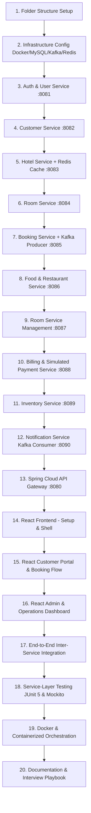

# Hospitality Management System - Step-by-Step Implementation Roadmap

This document outlines the ordered implementation plan to construct the Hospitality Management System in 20 distinct, production-style phases.

---

## 20-Step Implementation Roadmap

---

## Service-by-Service Technical Specification

### Phase 1: Complete Project Structure (Done)
- Created root folder `hospitality-management-system/`.
- Created structured subdirectories for all 11 backend microservices, `frontend/hospitality-ui`, `infrastructure/` (docker, kafka, redis, mysql), and `docs/`.

### Phase 2: Infrastructure Configuration
- **MySQL Initialization Script** (`init-databases.sql`):
  - Pre-creates 10 isolated schemas: `hms_auth_db`, `hms_customer_db`, `hms_hotel_db`, `hms_room_db`, `hms_booking_db`, `hms_food_db`, `hms_rsm_db`, `hms_billing_db`, `hms_inventory_db`, `hms_notification_db`.
  - Grants permissions to `hms_user` (`hms_password`).
- **Kafka Setup**:
  - Apache Kafka broker (and Zookeeper or KRaft) configured for local development.
  - Definition of topic creation scripts for `hms.booking.events`, `hms.payment.events`, `hms.food.events`, `hms.roomservice.events`, `hms.inventory.events`.
- **Redis Setup**:
  - Redis 7.x server configuration with persistent storage and key eviction policy (`volatile-lru`).

### Phase 3: Auth / User Service (`auth-service` :8081)
- **Why it exists**: Centralized identity and access management (IAM), preventing credentials from traversing multiple downstream services.
- **Responsibilities**:
  - User registration, authentication, JWT token generation with user claims (`userId`, `email`, `roles`).
  - Password hashing with `BCryptPasswordEncoder` (strength 12).
- **Entities**: `User`, `Role` (`ROLE_CUSTOMER`, `ROLE_ADMIN`, `ROLE_STAFF`), `UserRole`.
- **APIs**:
  - `POST /api/v1/auth/register`
  - `POST /api/v1/auth/login`
  - `GET /api/v1/auth/validate` (Token introspection for gateway)
- **Database**: `hms_auth_db`.

### Phase 4: Customer Service (`customer-service` :8082)
- **Why it exists**: Isolates customer profile data and guest preferences from core auth credentials.
- **Responsibilities**:
  - Customer profile CRUD, address management, identity verification data, phone numbers.
- **Entities**: `CustomerProfile`, `Address`.
- **APIs**:
  - `POST /api/v1/customers` (Create profile on registration)
  - `GET /api/v1/customers/me` (Current logged-in customer)
  - `GET /api/v1/customers/{id}` (Internal & Admin lookup)
  - `PUT /api/v1/customers/{id}` (Update profile)
- **Communication**: Called via OpenFeign by `booking-service` to validate customer status.

### Phase 5: Hotel Service (`hotel-service` :8083)
- **Why it exists**: Serves the hotel catalog and search engine, which is the most read-heavy operation in hospitality platforms.
- **Responsibilities**:
  - Hotel property management (Name, Address, City, Country, Star Rating, Amenities, Active status).
  - Search and filter hotels by City, Name, Star rating with Spring Data JPA Specifications and pagination.
  - Redis cache-aside implementation (`@Cacheable`, `@CacheEvict`).
- **Entities**: `Hotel`, `Amenity`, `HotelImage`.
- **APIs**:
  - `GET /api/v1/hotels` (Paginated search with query params: `city`, `name`, `minRating`)
  - `GET /api/v1/hotels/{id}` (Cached hotel details)
  - `POST /api/v1/hotels` (Admin: create hotel - evicts cache)
  - `PUT /api/v1/hotels/{id}` (Admin: update hotel - evicts cache)
  - `DELETE /api/v1/hotels/{id}` (Admin: deactivate hotel)

### Phase 6: Room Service (`room-service` :8084)
- **Why it exists**: Manages individual room units, room categories, pricing, and room lifecycle status.
- **Responsibilities**:
  - Room catalog (Single, Double, Deluxe, Suite, Executive).
  - Room status tracking: `AVAILABLE`, `BOOKED`, `OCCUPIED`, `MAINTENANCE`, `CLEANING`.
  - Room availability checks and atomic status locks.
- **Entities**: `Room`, `RoomType`, `RoomStatusHistory`.
- **APIs**:
  - `GET /api/v1/rooms/hotel/{hotelId}` (Rooms belonging to hotel)
  - `GET /api/v1/rooms/{id}` (Room details)
  - `GET /api/v1/rooms/available?hotelId=X&typeId=Y`
  - `POST /api/v1/rooms` (Admin create room)
  - `PATCH /api/v1/rooms/{id}/status` (Update room status)
- **Communication**: Feign client invoked by `booking-service` to check room state.

### Phase 7: Booking Service (`booking-service` :8085)
- **Why it exists**: The core transactional engine of the platform, orchestrating reservations and checkout.
- **Responsibilities**:
  - Check room availability over desired date ranges.
  - Prevent double bookings using database unique composite constraints and locking.
  - Publish Kafka events: `BookingCreatedEvent`, `BookingConfirmedEvent`, `BookingCancelledEvent`.
  - Handle payment outcome events to confirm or cancel temporary holds.
- **Entities**: `Booking`, `BookingItem`, `RoomDateLock`.
- **APIs**:
  - `POST /api/v1/bookings` (Create tentative booking hold)
  - `GET /api/v1/bookings/my-bookings` (Customer booking history)
  - `GET /api/v1/bookings/{id}` (Booking details)
  - `POST /api/v1/bookings/{id}/cancel` (Cancel booking)
  - `GET /api/v1/bookings` (Admin view all bookings)

### Phase 8: Food / Restaurant Service (`food-service` :8086)
- **Why it exists**: Independent dining and in-room dining restaurant ordering module.
- **Responsibilities**:
  - Manage menu items, categories, pricing, and availability.
  - Handle food orders for guests (linking to active room or booking).
  - Publish `FoodOrderCreatedEvent` to Kafka.
- **Entities**: `FoodItem`, `MenuCategory`, `FoodOrder`, `FoodOrderItem`.
- **APIs**:
  - `GET /api/v1/food/menu` (Public menu catalog)
  - `POST /api/v1/food/orders` (Guest creates food order)
  - `GET /api/v1/food/orders/customer/{customerId}`
  - `PATCH /api/v1/food/orders/{id}/status` (Staff updates order status: PREPARING, DELIVERED)

### Phase 9: Room Service Management (`room-service-management` :8087)
- **Why it exists**: Housekeeping, amenity replenishment, and guest service requests.
- **Responsibilities**:
  - Guest requests for Cleaning, Towels, Bottled Water, Maintenance.
  - Staff dispatching and request lifecycle (`REQUESTED`, `ASSIGNED`, `IN_PROGRESS`, `COMPLETED`).
  - Publish `RoomServiceRequestedEvent` to Kafka.
- **Entities**: `RoomServiceRequest`, `ServiceCatalogItem`.
- **APIs**:
  - `POST /api/v1/room-service/requests` (Guest places service request)
  - `GET /api/v1/room-service/requests/my-requests`
  - `GET /api/v1/room-service/requests/active` (Staff task list)
  - `PATCH /api/v1/room-service/requests/{id}/status`

### Phase 10: Billing / Payment Service (`billing-service` :8088)
- **Why it exists**: Aggregates all charges across the hotel stay (room reservation, restaurant dining, chargeable amenities) and processes payments.
- **Responsibilities**:
  - Simulated payment processing (Success / Failed simulation modes without external gateway dependencies).
  - Consolidated Invoice generation.
  - Publishes `PaymentCompletedEvent` to Kafka.
- **Entities**: `Invoice`, `InvoiceLineItem`, `PaymentTransaction`.
- **APIs**:
  - `POST /api/v1/billing/pay` (Process simulated payment)
  - `GET /api/v1/billing/invoices/booking/{bookingId}`
  - `GET /api/v1/billing/invoices/{id}`

### Phase 11: Inventory Service (`inventory-service` :8089)
- **Why it exists**: Hotel physical asset and consumable tracking.
- **Responsibilities**:
  - Track stock levels of linens, towels, toiletries, cleaning chemicals, and culinary ingredients.
  - Automatically decrement stock upon consuming `FoodOrderCreatedEvent` and `RoomServiceRequestedEvent`.
  - Alert on low inventory threshold.
- **Entities**: `InventoryItem`, `StockTransaction`, `Supplier`.
- **APIs**:
  - `GET /api/v1/inventory` (Admin inventory audit)
  - `POST /api/v1/inventory` (Add new stock item)
  - `PATCH /api/v1/inventory/{id}/restock` (Restock items)

### Phase 12: Notification Service (`notification-service` :8090)
- **Why it exists**: Asynchronous notification ingestion and dispatch hub.
- **Responsibilities**:
  - Listens to Kafka topics: `hms.booking.events`, `hms.payment.events`, `hms.roomservice.events`.
  - Stores simulated notification records (email/SMS templates rendered in database and logged with SLF4J).
- **Entities**: `NotificationLog`.
- **APIs**:
  - `GET /api/v1/notifications/user/{userId}` (Customer notification feed)
  - `PATCH /api/v1/notifications/{id}/read`

### Phase 13: Spring Cloud API Gateway (`api-gateway` :8080)
- **Responsibilities**:
  - Reverse proxy routing for all 10 domain microservices.
  - JWT Authentication Filter validating token headers before routing.
  - Header enrichment: injects `X-User-Id`, `X-User-Role`, `X-User-Email` for downstream services.
  - Global CORS configuration for `http://localhost:3000`.

### Phase 14-16: ReactJS Frontend Application (`frontend/hospitality-ui`)
- **Structure**:
  - Vite + React 18 SPA.
  - Responsive, clean, modern UI with clear navigation.
  - Customer Portal: Search Hotels -> View Hotel -> Select Room -> Book -> Pay -> My Bookings -> Order Food -> Request Room Service -> Invoices -> Notifications.
  - Admin Portal: Manage Hotels, Manage Rooms, Manage Food Menu, View Bookings, Inventory Audit, Room Service Staff Queue.
  - Centralized Axios client configured with JWT interceptor.

### Phase 17: Inter-Service End-to-End Integration
- OpenFeign configurations with fallback error handling.
- Kafka producer/consumer JSON serialization & deserialization verification.

### Phase 18: Testing (JUnit 5 & Mockito)
- Unit tests for core business logic:
  - `BookingServiceTest` (Availability validation, double-booking rejection).
  - `HotelServiceTest` (Cache-aside hit/miss logic).
  - `AuthServiceTest` (Password verification, token generation).
  - `BillingServiceTest` (Invoice aggregation).

### Phase 19: Docker & Container Orchestration
- Multi-stage Dockerfiles for backend services and frontend.
- Root `docker-compose.yml` linking MySQL, Redis, Kafka, API Gateway, services, and React UI.

### Phase 20: Documentation & Interview Playbook
- Comprehensive `README.md` with startup guides.
- Detailed interview Q&A guide addressing all 20 interview topics specified in the requirements.
