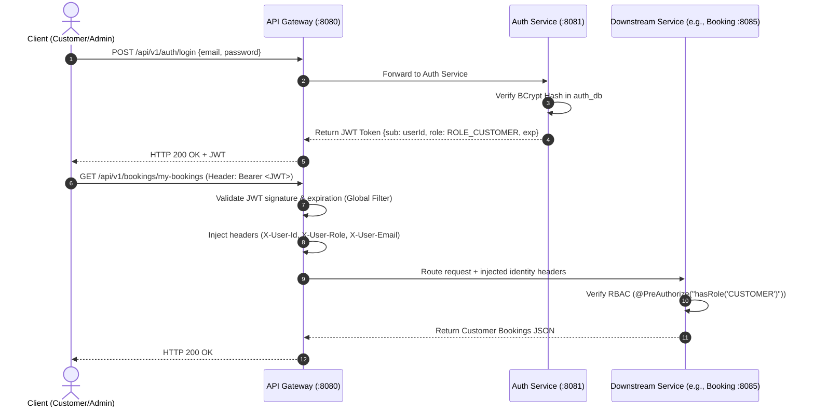

# Hospitality Management System - System Architecture & Design Specification

## 1. Executive Summary & Design Principles

The **Hospitality Management System (HMS)** is a production-grade, distributed microservices platform engineered using **Java 21**, **Spring Boot 3.3.4**, **Spring Cloud 2023.0.3 (Netflix Eureka, Gateway, LoadBalancer)**, **Apache Kafka (KRaft mode)**, **Redis 7**, and **PostgreSQL 16**, fronted by a **React 18** luxury single-page application.

### Core Architectural Principles
1. **Database-per-Service**: Each microservice strictly encapsulates its own PostgreSQL database schema. No service directly queries another service's database.
2. **Service Discovery & Dynamic Routing**: Spring Cloud Netflix Eureka Server (Port 8761) maintains real-time instance registries and health heartbeats. Spring Cloud Gateway and Feign route dynamically using `lb://<service-name>` virtual URIs.
3. **Selective Synchronous vs. Asynchronous Communication**:
   - **REST (OpenFeign)** is used when an immediate, synchronous response or strict transactional validation is required (e.g., checking room availability before confirming a reservation, verifying customer existence).
   - **Apache Kafka** is used for decoupled, event-driven domain events (e.g., `BookingCreated`, `BookingConfirmed`, `BookingCancelled`, `PaymentCompleted`, `FoodOrderCreated`, `RoomServiceRequested`, `InventoryUpdated`).
4. **Cache-Aside with Redis**: Read-heavy operations (hotel catalog, search filters, room types) are aggressively cached using the Cache-Aside pattern with TTL and proactive cache invalidation on write/update.
5. **Idempotency & Concurrency Safety**: Strict concurrency controls (optimistic locking `@Version`, pessimistic database locking, and unique composite constraints) prevent double bookings under peak traffic.
6. **Interview-Ready Explainability**: Clean, realistic, and maintainable implementation without extraneous frameworks, designed specifically for a 3–4+ years Java Backend Developer technical discussion.

---

## 2. High-Level System Architecture

```mermaid
flowchart TB
    subgraph Clients ["Client Layer"]
        PortalUI["React 18 Luxury Portal (Port 5173)<br/>• Guest Reservation & Dining<br/>• Operations & Admin Kanban"]
    end

    subgraph Discovery ["Service Discovery Tier"]
        Eureka["Eureka Discovery Server (Port 8761)<br/>• Service Registry<br/>• Heartbeat Health Checks"]
    end

    subgraph Gateway ["Edge & Gateway Layer"]
        APIGateway["Spring Cloud Gateway (Port 8080)<br/>• JWT Authentication Filter<br/>• Global CORS & Header Injection<br/>• Dynamic lb:// Load Balancing"]
    end

    Clients -->|HTTP / REST (JSON)| APIGateway
    APIGateway -.->|Fetch Active Registry| Eureka

    subgraph CoreServices ["Core Domain Microservices (Port Range: 8081 - 8090)"]
        AuthSvc["auth-service (:8081)<br/>• JWT Token Issuance<br/>• User Accounts & RBAC"]
        CustSvc["customer-service (:8082)<br/>• Customer Profiles<br/>• KYC Validation"]
        HotelSvc["hotel-service (:8083)<br/>• Hotel Metadata & Search<br/>• Redis Cache-Aside"]
        RoomSvc["room-service (:8084)<br/>• Room Inventory & Pricing<br/>• @Version Lock"]
        BookingSvc["booking-service (:8085)<br/>• Booking Orchestration<br/>• Double-Booking Prevention"]
        FoodSvc["food-service (:8086)<br/>• Restaurant Menu Catalog<br/>• Batch Item Resolution"]
        RSMgtSvc["room-service-management (:8087)<br/>• In-Room Dining & KOT<br/>• Operations State Machine"]
        BillingSvc["billing-service (:8088)<br/>• 18% GST Invoicing<br/>• Simulated Payment Gateway"]
        InventorySvc["inventory-service (:8089)<br/>• Hotel Supplies & Linen<br/>• Low-Stock Auditing"]
        NotifSvc["notification-service (:8090)<br/>• Multi-Channel Dispatch<br/>• Email / SMS Event Logs"]
    end

    CoreServices -.->|Heartbeat Registration| Eureka

    APIGateway ==>|lb://auth-service| AuthSvc
    APIGateway ==>|lb://customer-service| CustSvc
    APIGateway ==>|lb://hotel-service| HotelSvc
    APIGateway ==>|lb://room-service| RoomSvc
    APIGateway ==>|lb://booking-service| BookingSvc
    APIGateway ==>|lb://food-service| FoodSvc
    APIGateway ==>|lb://room-service-management| RSMgtSvc
    APIGateway ==>|lb://billing-service| BillingSvc
    APIGateway ==>|lb://inventory-service| InventorySvc
    APIGateway ==>|lb://notification-service| NotifSvc

    subgraph SyncComm ["Synchronous Inter-Service Calls (OpenFeign)"]
        BookingSvc -.->|Check Room Availability / Lock| RoomSvc
        BookingSvc -.->|Validate Customer ID & Status| CustSvc
        RoomSvc -.->|Verify Hotel Belongs| HotelSvc
    end

    subgraph KafkaBroker ["Event Backbone (Apache Kafka)"]
        TopicBooking["hms.booking.events<br/>(BookingCreated, Confirmed, Cancelled)"]
        TopicPayment["hms.payment.events<br/>(PaymentCompleted, PaymentFailed)"]
        TopicFood["hms.food.events<br/>(FoodOrderCreated)"]
        TopicRS["hms.roomservice.events<br/>(RoomServiceRequested)"]
        TopicInventory["hms.inventory.events<br/>(InventoryUpdated)"]
    end

    BookingSvc -->|Publish| TopicBooking
    BillingSvc -->|Publish| TopicPayment
    FoodSvc -->|Publish| TopicFood
    RSMgtSvc -->|Publish| TopicRS
    InventorySvc -->|Publish| TopicInventory

    TopicBooking -->|Consume| NotifSvc
    TopicBooking -->|Consume| BillingSvc
    TopicPayment -->|Consume| BookingSvc
    TopicPayment -->|Consume| NotifSvc
    TopicFood -->|Consume| BillingSvc
    TopicFood -->|Consume| InventorySvc
    TopicRS -->|Consume| BillingSvc
    TopicRS -->|Consume| InventorySvc

    subgraph CacheStore ["Redis Cache"]
        RedisCluster[("Redis (Port 6379)<br/>Hotels Search & Details Cache")]
    end
    HotelSvc <-->|Read / Write / Invalidate| RedisCluster

    subgraph Storage ["Independent Schemas (PostgreSQL 16)"]
        DB_Auth[(hms_auth_db)]
        DB_Cust[(hms_customer_db)]
        DB_Hotel[(hms_hotel_db)]
        DB_Room[(hms_room_db)]
        DB_Booking[(hms_booking_db)]
        DB_Food[(hms_food_db)]
        DB_RSM[(hms_rsm_db)]
        DB_Billing[(hms_billing_db)]
        DB_Inv[(hms_inventory_db)]
        DB_Notif[(hms_notification_db)]
    end

    AuthSvc --- DB_Auth
    CustSvc --- DB_Cust
    HotelSvc --- DB_Hotel
    RoomSvc --- DB_Room
    BookingSvc --- DB_Booking
    FoodSvc --- DB_Food
    RSMgtSvc --- DB_RSM
    BillingSvc --- DB_Billing
    InventorySvc --- DB_Inv
    NotifSvc --- DB_Notif
```

---

## 3. Communication Strategy: REST vs. Kafka

| Requirement / Interaction | Communication Protocol | Rationale | Failure Handling |
| :--- | :--- | :--- | :--- |
| **User Login & Token Generation** | Synchronous REST | Client requires immediate JWT token to proceed. | Standard 401 Unauthorized / 400 Bad Request. |
| **Room Availability Check during Booking** | Synchronous REST (OpenFeign) | Booking creation cannot proceed without guaranteed immediate confirmation of room status. | Circuit breaker fallback returns "Room check service unavailable, please retry". |
| **Customer Validation in Booking** | Synchronous REST (OpenFeign) | Booking requires immediate confirmation that customer profile is active. | Immediate 404 / 400 error response to booking client. |
| **Booking Created Event** | Asynchronous Kafka (`hms.booking.events`) | Notifications and billing setup do not need to block the user's booking creation transaction. | Dead Letter Topic (DLT), Kafka consumer retries with exponential backoff. |
| **Payment Completed Event** | Asynchronous Kafka (`hms.payment.events`) | Simulates real-world webhook/event callbacks; updates Booking status to `CONFIRMED` and triggers notification. | Idempotent consumers using transaction IDs. |
| **Food Order Placed** | Asynchronous Kafka (`hms.food.events`) | Triggers inventory deduction (ingredients) and adds charges to active room bill asynchronously. | Compensating transaction / alert if inventory drops below zero. |
| **Room Service Request** | Asynchronous Kafka (`hms.roomservice.events`) | Alerts staff queue, updates bill, and consumes room supplies (towels, toiletries). | Event retry topic. |

---

## 4. Redis Caching Strategy (Hotel Search & Details)

### Pattern: Cache-Aside (Lazy Loading + Invalidation)
1. **Read Request (Hotel Search / Details)**:
   - Key format: `hms:hotel:id:{hotelId}` for single entity.
   - Key format: `hms:hotel:search:{city}:{page}:{size}` for search queries.
   - **Step 1**: Check if key exists in Redis.
   - **Step 2 (Cache Hit)**: Return cached JSON payload directly (< 5ms response time).
   - **Step 3 (Cache Miss)**: Query MySQL `hotel_db` via Spring Data JPA.
   - **Step 4**: Serialize entity/DTO to JSON and write to Redis with a TTL (Time-To-Live = 30 minutes).
   - **Step 5**: Return response to client.

2. **Write / Update Request (Admin updates hotel details)**:
   - **Step 1**: Save updated hotel record to MySQL inside `@Transactional` boundary.
   - **Step 2**: Evict cache entry: `redisTemplate.delete("hms:hotel:id:" + hotelId)` and invalidate search query keys using key pattern matching or Redis cache manager (`@CacheEvict(value = "hotels", key = "#id")`).
   - Ensures no stale data is served to customers.

3. **Cache Expiration Handling**:
   - TTL of 30 minutes ensures eventual consistency even if an unexpected node failure skipped eviction.
   - Prevents memory bloat in Redis instance.

---

## 5. Concurrency & Double-Booking Prevention

### The Problem
During peak booking periods (e.g., holiday seasons, flash discounts), hundreds of users may attempt to book the same room for overlapping dates simultaneously.

### Multi-Layered Defense Mechanism
1. **Database-Level Unique Constraint (`room_bookings`)**:
   - Table `room_daily_availability` or `booking_room_dates` enforces a composite unique constraint: `UNIQUE KEY uk_room_date (room_id, booking_date)`.
   - Any concurrent insert attempting to claim the same room on the same date will trigger a `DataIntegrityViolationException` at the database engine level, immediately rolling back the second transaction.
2. **Pessimistic / Optimistic Locking**:
   - For fast room availability locking during the checkout flow:
   - In `RoomService`, room status is updated using optimistic locking (`@Version private Long version;`).
   - Or during direct booking confirmation, `booking-service` acquires a `SELECT ... FOR UPDATE` (Pessimistic Write Lock) on the date inventory table for the duration of the reservation creation.
3. **Two-Phase Reservation Lifecycle**:
   - `PENDING_PAYMENT` (15-minute temporary hold with expiry timer).
   - `CONFIRMED` (After `PaymentCompleted` Kafka event is consumed).
   - `CANCELLED` / `EXPIRED` (Releases the hold back to available pool).

---

## 6. Authentication, Security & RBAC Flow



---

## 7. Service Port Mapping & Database Schemas

| Service Name | Port | Database Schema | Primary Role |
| :--- | :--- | :--- | :--- |
| **API Gateway** | `8080` | None (Stateless routing) | Single entry point, CORS, JWT extraction, rate-limiting |
| **auth-service** | `8081` | `hms_auth_db` | Users, Roles, BCrypt passwords, JWT token provider |
| **customer-service** | `8082` | `hms_customer_db` | Customer profiles, address, contact details, preferences |
| **hotel-service** | `8083` | `hms_hotel_db` | Hotels, addresses, amenities, star ratings, Redis cache |
| **room-service** | `8084` | `hms_room_db` | Rooms, room types, pricing, room status lifecycle |
| **booking-service** | `8085` | `hms_booking_db` | Reservations, booking items, dates, double-booking safety |
| **food-service** | `8086` | `hms_food_db` | Menus, food items, categories, customer food orders |
| **room-service-management** | `8087` | `hms_rsm_db` | Cleaning, maintenance, towel/water guest requests |
| **billing-service** | `8088` | `hms_billing_db` | Aggregated guest bills, simulated payment transactions |
| **inventory-service** | `8089` | `hms_inventory_db` | Stock items, replenishment alerts, operational supplies |
| **notification-service** | `8090` | `hms_notification_db` | Kafka event listener, notification history log |
| **React Frontend** | `3000` | Browser LocalStorage / Memory | Single Page UI for Guests & Staff/Admins |

---

## 8. Scalability & High-Traffic Architecture

1. **Stateless Microservices**:
   - Zero HTTP session state stored on servers. Any request can be served by any instance behind the API Gateway or a reverse proxy.
2. **Horizontal Autoscaling**:
   - Services like `hotel-service` and `booking-service` can be scaled horizontally (`docker compose up --scale hotel-service=3`).
3. **Database Performance**:
   - B-Tree indexes on frequently filtered fields: `hotel.city`, `hotel.star_rating`, `booking.customer_id`, `room.hotel_id`.
   - Pagination (Spring Data `Pageable`) enforced on all list endpoints (defaults: `page=0, size=20`).
4. **Connection Pooling**:
   - HikariCP configured with optimal pool size (`maximum-pool-size: 10`, `minimum-idle: 5`) to prevent database connection starvation.
