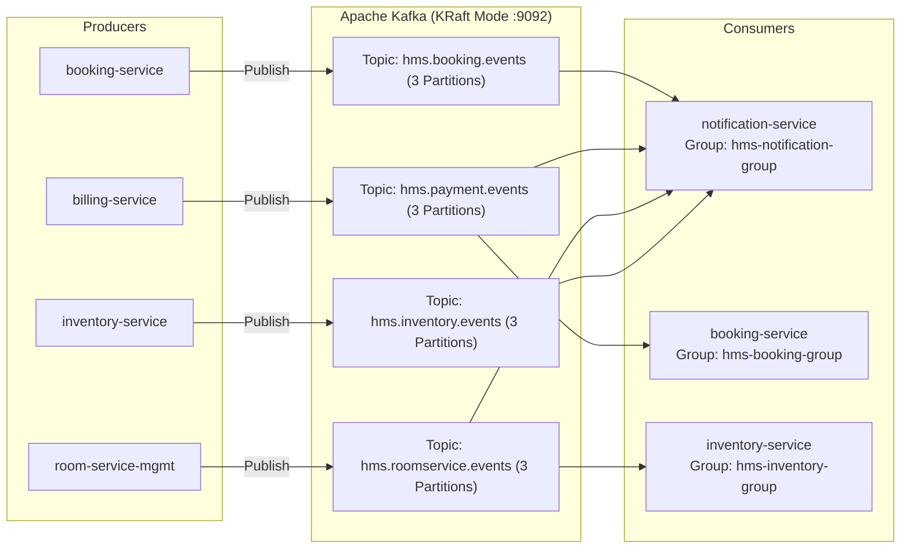
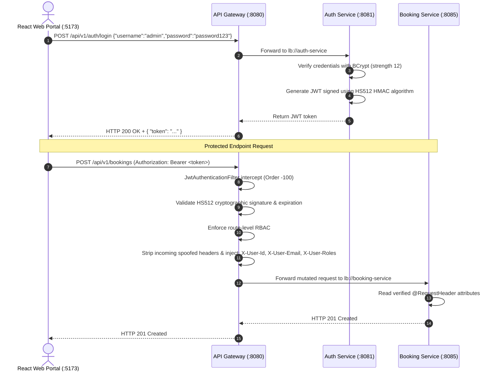

# MASTER PROJECT INTERVIEW DOCUMENT
## Grand Luxe Hospitality Management System — Java Spring Boot Microservices
**Target Role:** Java Backend Developer (3–4+ Years Experience)  
**Document Purpose:** Single-source master interview preparation guide covering actual architecture, verified code implementations, configurations, trade-offs, and spoken interview scripts.

---

# 1. Project Overview

### 2–3 Sentence Interview Introduction (Spoken Script)
> *"I worked on the backend of the **Grand Luxe Hospitality Management System**, a multi-property hotel reservation and operations platform built with **Java 21, Spring Boot 3.3.4, and Spring Cloud 2023.0.3**. The system uses a **Database-per-Service architecture with 10 dedicated PostgreSQL databases**, an event-driven messaging backbone using **Apache Kafka in KRaft mode**, and **Spring Cloud Netflix Eureka** with an edge **API Gateway** for service discovery and perimeter JWT security. The platform implements inter-service resilience using **Resilience4j**, concurrency control using **optimistic locking and transaction advisory locks**, and decoupled operational workflows."*

### Detailed Explanation
The **Grand Luxe Hospitality Management System (HMS)** is a multi-service hospitality platform designed to manage the guest journey and hotel operations across multiple properties. Traditional monolithic hotel systems often face schema coupling, single points of failure, and database connection pool contention during peak reservation periods or busy dining hours.

This platform addresses those operational requirements by decomposing core business domains into autonomous microservices. Each domain manages its own data persistence, business rules, and API endpoints.

#### Problems Addressed in the Project:
1. **Double-Booking & Reservation Contention:** Prevents concurrent guests from booking the same room for overlapping dates using mathematical interval conflict queries, PostgreSQL transaction advisory locks (`pg_advisory_xact_lock`), and Hibernate `@Version` optimistic locking.
2. **Service Isolation Across Operational Units:** Ensures that if in-room dining, inventory, or notification services experience slow responses or downtime, core hotel browsing and room booking continue without cascading failure.
3. **Data Boundary Enforcement:** Prevents cross-table SQL joins between reservations, dining menus, and billing by enforcing the Database-per-Service pattern across 10 isolated PostgreSQL databases.
4. **Kitchen Order Latency & Network Overhead:** Automates Kitchen Order Ticket (KOT) lifecycles and batch recipe resolution, avoiding the N+1 network call anti-pattern between dining and menu services.
5. **Decoupled Notification Dispatching:** Decouples user transactions from simulated notification delivery by publishing domain events to Apache Kafka.

#### Main Users and Actors:
- **Guests / Customers:** Search hotel properties, filter available rooms, place room bookings, order in-room dining, view bills, and submit payments.
- **Front Desk Staff & Hotel Managers:** Update room housekeeping statuses (`AVAILABLE`, `OCCUPIED`, `MAINTENANCE`, `DIRTY`) and monitor reservation queues.
- **Kitchen & Dining Staff:** Receive Kitchen Order Tickets (KOT) in real-time, transition orders (`PLACED` $\to$ `PREPARING` $\to$ `READY` $\to$ `DELIVERED`), and track food prep times.
- **Inventory & Store Managers:** Manage hotel consumable stock levels, track stock movement audit logs upon order delivery, monitor low-stock reorder alerts, and log supplier restocks.
- **System Administrators:** Manage user accounts, enforce Role-Based Access Control (RBAC), and configure hotel property metadata.

---

# 2. Project in Simple Words

If an interviewer asks: *"What does your project actually do?"*, here is how to explain it in everyday conversational English:

> *"Think of this system as the digital backend behind a hotel chain.
> 
> When a guest opens our web portal, they browse hotels across different cities. Because hotel descriptions and amenities change infrequently, we cache hotel profiles in **Redis** using the Cache-Aside pattern so repeated queries avoid hitting the PostgreSQL database.
> 
> When the guest selects dates and books a room, our **Booking Service** validates customer and room availability over OpenFeign, checks for date-overlap conflicts in the database, and places a **15-minute temporary hold** on the room. 
> 
> Next, the guest completes payment. Our **Billing Service** calculates taxes (configured with a default 18% GST rate) and simulates the payment gateway. Once payment succeeds, it publishes an event to **Apache Kafka**.
> 
> The **Booking Service** consumes this payment event and marks the reservation confirmed. At the same time, our **Notification Service** consumes the event and logs an email/SMS confirmation receipt.
> 
> Once checked in, the guest can order food from room service. Our **Room Service Management** service verifies active booking status, retrieves menu items in a single batch call from **Food Service**, and tracks the kitchen order lifecycle. When the meal is delivered, a Kafka event triggers our **Inventory Service** to automatically record ingredient deductions in a stock movement audit ledger.
> 
> All client traffic routes through a **Spring Cloud API Gateway** that verifies JWT tokens signed using the HS512 HMAC algorithm before forwarding requests to downstream services, with **Eureka** providing dynamic service discovery."*

---

# 3. Business Flow

Below are the four primary end-to-end business flows implemented in the project code:

### Flow 1: Hotel Room Booking Hold Creation
```text
Guest Browser 
  → API Gateway (:8080) [Validates JWT & Injects X-User-Id]
  → Booking Service (:8085) [POST /api/v1/bookings]
  → Customer Client (Feign) → Customer Service (:8082) [GET /api/v1/customers/{id}/validate]
  → Room Client (Feign) → Room Service (:8084) [GET /api/v1/rooms/{id}/available]
  → Booking DB (PostgreSQL hms_booking_db) [Acquires advisory lock & checks findConflictingBookings]
  → Room Client (Feign) → Room Service (:8084) [PUT/PATCH /api/v1/rooms/{id}/status to BOOKED]
  → Booking DB (PostgreSQL hms_booking_db) [Persists Booking with status = PENDING_PAYMENT, holdExpiresAt = now + 15m]
  → Booking Service publishes BookingCreatedEvent to Kafka topic 'hms.booking.events'
  → Notification Service (:8090) consumes event & logs SMS/Email notification record
  → Returns Booking ID & hold details to Guest
```

### Flow 2: Billing & Payment Simulation
```text
Guest Browser 
  → API Gateway (:8080) 
  → Billing Service (:8088) [POST /api/v1/billing/pay]
  → Booking Client (Feign) → Booking Service (:8085) [GET /api/v1/bookings/{id}]
  → Billing Service computes base amount + default 18% GST tax
  → Executes payment simulation (checks card formatting / simulated failure flags)
  → Saves Bill record with status = PAID in hms_billing_db
  → Billing Service publishes PaymentCompletedEvent to Kafka topic 'hms.payment.events'
  → Booking Service (:8085) PaymentEventConsumer receives event & transitions booking to CONFIRMED
  → Notification Service (:8090) BookingEventConsumer receives event & logs payment receipt
```

### Flow 3: In-Room Dining (KOT) & Automated Inventory Audit
```text
Guest in Room 
  → API Gateway (:8080)
  → Room Service Management (:8087) [POST /api/v1/room-service/orders]
  → BookingServiceClient (Feign) → Booking Service (:8085) [GET /api/v1/bookings/{id} to verify active booking]
  → FoodServiceClient (Feign) → Food Service (:8086) [POST /api/v1/food/batch to fetch dishes & prices in 1 hop]
  → Saves Order in hms_rsm_db with frozen price snapshots (status = PLACED)
  → Kitchen Staff transitions order: PLACED → PREPARING → READY → DELIVERED [PATCH /api/v1/room-service/orders/{id}/status]
  → Upon DELIVERED status, RSM publishes event to Kafka topic 'hms.roomservice.events'
  → Inventory Service (:8089) RoomServiceOrderEventConsumer receives event
  → Inventory Service records stock deductions in stock_movement_logs table in hms_inventory_db
  → If stock falls below reorderThreshold, Inventory Service publishes event to 'hms.inventory.events'
  → Notification Service receives alert and logs warning
```

### Flow 4: 15-Minute Unpaid Hold Expiration Periodic Sweep
```text
BookingExpiryScheduler (Booking Service :8085)
  → Fires every 60 seconds (@Scheduled(fixedRate = 60000))
  → Calls bookingService.expireUnpaidHolds()
  → Executes SQL: SELECT b FROM Booking b WHERE b.status = 'PENDING_PAYMENT' AND b.holdExpiresAt <= :now
  → For each expired record:
      - Sets status = CANCELLED, cancellationReason = 'Temporary 15-minute hold expired due to lack of payment'
      - Calls Room Client (Feign) to update Room status back to AVAILABLE
      - Publishes BookingCancelledEvent and BookingExpiredEvent to 'hms.booking.events'
  → Notification Service consumes event & logs hold cancellation record
```

---

# 4. Technology Stack

The following technologies were verified directly from project POM files, source code, and configuration:

| Technology | Version in Project | Where Used | Verification Status | Notes / Source Confirmation |
|---|---|---|---|---|
| **Java** | `21` (LTS) | All 12 backend modules | **Confirmed** | `<java.version>21</java.version>` in POMs. Virtual Threads were *not configured* in the project. |
| **Spring Boot** | `3.3.4` | All microservice modules | **Confirmed** | Spring Boot parent version `3.3.4` in service POMs. |
| **Spring Cloud** | `2023.0.3` (Leyton) | Gateway, Eureka, OpenFeign, LoadBalancer | **Confirmed** | `<spring-cloud.version>2023.0.3</spring-cloud.version>` in POMs. |
| **Spring WebFlux / Netty** | Bundled in Spring Cloud Gateway | `api-gateway` (:8080) | **Confirmed** | Reactive non-blocking reverse proxy. |
| **Spring MVC / Tomcat** | `spring-boot-starter-web` | All 10 domain services (:8081–:8090) | **Confirmed** | Standard servlet-based web layer for domain REST APIs. |
| **Spring Cloud Netflix Eureka** | `spring-cloud-starter-netflix-eureka-server` / `client` | `eureka-server` (:8761) & all 11 client services | **Confirmed** | Dynamic service registry and discovery client. |
| **Spring Cloud OpenFeign** | `spring-cloud-starter-openfeign` (with `feign-hc5`) | Inter-service synchronous REST calls | **Confirmed** | Declarative HTTP client using Apache HttpClient 5 connection pooling. |
| **Resilience4j** | `2.2.0` (`resilience4j-spring-boot3`) | `booking-service`, `billing-service`, `room-service`, `room-service-management`, `inventory-service` | **Confirmed** | Circuit Breaker, Retry with exponential backoff, and fallback delegates. |
| **Spring Data JPA & Hibernate** | `spring-boot-starter-data-jpa` | All 10 domain services (:8081–:8090) | **Confirmed** | PostgreSQL relational ORM with `ddl-auto: update`. |
| **PostgreSQL** | `16` (Docker container `hms-postgres`) | 10 isolated databases | **Confirmed** | Defined in `docker-compose-infra.yml` and `init-databases.sh`. |
| **Redis** | `7` (Docker container `hms-redis`) | `hotel-service` (:8083) | **Confirmed** | Used for Cache-Aside caching (`hotel_details` and `hotel_search` caches). |
| **Apache Kafka** | `3.7.0` (Docker container `hms-kafka`) | Event-driven microservices | **Confirmed** | Runs in KRaft mode on port 9092. Configured with 3 partitions per topic. |
| **Spring Security** | `spring-boot-starter-security` | `auth-service` (:8081) | **Confirmed** | `SecurityFilterChain`, `BCryptPasswordEncoder(12)`. |
| **JJWT** | `0.12.5` (`jjwt-api`, `jjwt-impl`, `jjwt-jackson`) | `auth-service` (:8081) & `api-gateway` (:8080) | **Confirmed** | JWT token generation and validation signed using the HS512 HMAC algorithm. |
| **Jakarta Validation** | `spring-boot-starter-validation` | Domain services DTOs | **Confirmed** | `@NotNull`, `@NotBlank`, `@Min`, `@FutureOrPresent`. |
| **Spring Boot Actuator** | `spring-boot-starter-actuator` | All microservices | **Confirmed** | Health (`/actuator/health`), circuit breaker, and retry endpoints. |
| **Project Lombok** | `1.18.34` | All microservices | **Confirmed** | `@Data`, `@Builder`, `@RequiredArgsConstructor`, `@Slf4j`. |
| **JUnit 5 & Mockito** | `junit-jupiter`, `mockito-core` | All test modules | **Confirmed** | Comprehensive test suites across all services. |
| **React** | `19.2.8` | `frontend/hospitality-ui` (:5173) | **Confirmed** | `"react": "^19.2.8"` in `package.json` (React 19, not React 18). |
| **Vite** | `8.3.0` | `frontend/hospitality-ui` (:5173) | **Confirmed** | `"vite": "^8.3.0"` in `package.json`. |
| **Axios** | `1.20.0` | `frontend/hospitality-ui` (:5173) | **Confirmed** | `"axios": "^1.20.0"` in `package.json`. |
| **Docker Compose** | Compose v3.8 | `infrastructure/docker/docker-compose-infra.yml` | **Confirmed** | Orchestrates PostgreSQL 16, Redis 7, and Kafka 3.7.0 KRaft containers. |

### Technologies Explicitly Checked and NOT Found in the Project:
- **Kubernetes (K8s):** **Not found / Not confirmed from the project.** (No manifests or Helm charts exist).
- **AWS / Cloud Infrastructure (EC2, S3, RDS, EKS):** **Not found / Not confirmed from the project.**
- **CI/CD Pipelines (Jenkins, GitHub Actions, GitLab CI):** **Not found / Not confirmed from the project.**
- **Distributed Tracing (Zipkin / Jaeger / Spring Cloud Sleuth / Micrometer Tracing):** **Not found / Not confirmed from the project.**
- **Centralized Logging (ELK Stack / Logstash / Splunk):** **Not found / Not confirmed from the project.** (Logs use console SLF4J/Logback).
- **ZooKeeper:** **Not found / Not used.** (Kafka runs natively in KRaft mode).
- **Spring Cloud Config Server:** **Not found / Not used.** (Configuration is kept in local `application.yml` files).
- **Java Records for DTOs:** **Not found / Not used.** (DTOs are implemented as Lombok `@Data`/`@Builder` classes).
- **Virtual Threads:** **Not found / Not configured.** (No `spring.threads.virtual.enabled` configuration).

---

# 5. Microservices List

The project contains **12 backend Java microservices + 1 React frontend application**:

```text
1. eureka-server               (Port: 8761)
2. api-gateway                 (Port: 8080)
3. auth-service                (Port: 8081)
4. customer-service            (Port: 8082)
5. hotel-service               (Port: 8083)
6. room-service                (Port: 8084)
7. booking-service             (Port: 8085)
8. food-service                (Port: 8086)
9. room-service-management     (Port: 8087)
10. billing-service            (Port: 8088)
11. inventory-service          (Port: 8089)
12. notification-service       (Port: 8090)
13. hospitality-ui             (Port: 5173 - React 19.2.8 + Vite Frontend Portal)
```

---

# 6. Responsibility of Each Microservice

---

## Service 1: `eureka-server`
- **Port:** `8761`
- **Purpose:** Centralized Netflix Eureka service registry. Maintains live instance registrations and network locations for client-side load balancing.
- **Main Endpoints:**
  - `GET /` — Eureka web dashboard displaying active registered application instances.
  - `GET /eureka/apps` — REST endpoint returning current registry metadata.
- **Database:** None (In-memory registry).
- **Communication:** Receives registrations and periodic 30-second heartbeats from microservices.
- **Kafka:** Not used.
- **Eureka Configuration:** Server (`@EnableEurekaServer`). Sets `register-with-eureka: false` and `fetch-registry: false`.
- **Important Classes:** `EurekaServerApplication`.
- **Interview Explanation:** *"Eureka Server runs on port 8761 as our central service registry. Each microservice registers its network address on startup and renews its registration via heartbeats. The API Gateway and OpenFeign clients query Eureka to resolve virtual service names dynamically."*

---

## Service 2: `api-gateway`
- **Port:** `8080`
- **Purpose:** Reverse proxy entry point for all frontend traffic. Manages routing, dynamic load balancing (`lb://`), CORS preflight, and perimeter JWT authentication.
- **Main Endpoints:** Routes all `/api/v1/**` requests to downstream services.
  - Actuator endpoints: `/actuator/health`, `/actuator/gateway/routes`.
- **Database:** None.
- **Communication:** Non-blocking Netty WebFlux. Resolves routes using Spring Cloud LoadBalancer.
- **Security:** `JwtAuthenticationFilter` (`GlobalFilter` with order `-100`). Validates Bearer token using JJWT (signed using the HS512 HMAC algorithm), checks route-level RBAC (e.g. `ROLE_ADMIN` for hotel catalog modifications), strips client-supplied `X-User-*` headers, and forwards verified identity headers (`X-User-Id`, `X-User-Email`, `X-User-Roles`).
- **Kafka:** Not used.
- **Eureka:** Registered Eureka client (`lb://` route definitions).
- **Important Classes:** `ApiGatewayApplication`, `JwtAuthenticationFilter`, `JwtUtils`.
- **Interview Explanation:** *"Our API Gateway runs on Spring Cloud Gateway with Netty on port 8080. It acts as our perimeter security layer by intercepting requests, validating JWT signatures, checking route-level roles, stripping spoofed headers, and forwarding verified identity headers to internal services."*

---

## Service 3: `auth-service`
- **Port:** `8081`
- **Purpose:** Handles user registration, password hashing, role assignment, and JWT issuance upon login.
- **Main APIs:**
  - `POST /api/v1/auth/register` — Registers new users with BCrypt-hashed passwords (`strength = 12`).
  - `POST /api/v1/auth/login` — Authenticates credentials; returns JWT signed using the HS512 HMAC algorithm.
  - `GET /api/v1/auth/validate?token=...` — Validates whether a token string is valid or expired.
  - `GET /api/v1/auth/me` — Retrieves current authenticated user profile.
- **Database:** PostgreSQL (`hms_auth_db`).
- **Entities:** `User`, `Role`, `RoleName` (`ROLE_ADMIN`, `ROLE_STAFF`, `ROLE_CUSTOMER`).
- **Repositories:** `UserRepository`, `RoleRepository`.
- **Communication:** Called via API Gateway.
- **Kafka:** Not used.
- **Important Classes:** `AuthController`, `AuthService`, `AuthServiceImpl`, `SecurityConfig`, `JwtTokenProvider`, `CustomUserDetailsService`.
- **Interview Explanation:** *"Auth Service runs on port 8081 and manages user identities in `hms_auth_db`. It hashes passwords with BCrypt and signs JWT tokens containing user claims and roles using the HS512 HMAC algorithm."*

---

## Service 4: `customer-service`
- **Port:** `8082`
- **Purpose:** Manages guest master records, contact details, and addresses.
- **Main APIs:**
  - `POST /api/v1/customers` — Creates customer profile.
  - `GET /api/v1/customers/{id}` — Fetches customer profile by ID.
  - `GET /api/v1/customers/user/{userId}` — Fetches profile by Auth user ID.
  - `GET /api/v1/customers/me` — Fetches or auto-creates profile for current authenticated user.
  - `PUT /api/v1/customers/{id}` — Updates profile details.
  - `GET /api/v1/customers` — Lists all profiles (`ROLE_ADMIN` only).
  - `GET /api/v1/customers/{id}/validate` — Validates customer exists and is active (inter-service endpoint).
- **Database:** PostgreSQL (`hms_customer_db`).
- **Entities:** `CustomerProfile`, `Address`.
- **Repositories:** `CustomerProfileRepository`.
- **Communication:** Called by `booking-service` via OpenFeign (`CustomerClient`) to validate guest account status.
- **Kafka:** Not used.
- **Important Classes:** `CustomerController`, `CustomerService`, `CustomerServiceImpl`, `CustomerProfileRepository`.
- **Interview Explanation:** *"Customer Service manages guest profiles on port 8082. When a booking is created, Booking Service invokes `GET /api/v1/customers/{id}/validate` over OpenFeign to confirm the guest account is active."*

---

## Service 5: `hotel-service`
- **Port:** `8083`
- **Purpose:** Manages hotel properties, cities, star ratings, amenities, and dynamic search specifications with Redis caching.
- **Main APIs:**
  - `GET /api/v1/hotels` — Searches hotels with dynamic filters (city, name, minRating, pagination, sorting). Cached under `hotel_search`.
  - `GET /api/v1/hotels/{id}` — Retrieves hotel by ID. Cached under `hotel_details`.
  - `POST /api/v1/hotels` — Creates new hotel property (`ROLE_ADMIN` only). Evicts search caches.
  - `PUT /api/v1/hotels/{id}` — Updates hotel details. Evicts `hotel_details` and search caches.
  - `DELETE /api/v1/hotels/{id}` — Soft-deactivates hotel. Evicts caches.
- **Database:** PostgreSQL (`hms_hotel_db`) + Redis 7 cache.
- **Entities:** `Hotel`.
- **Repositories:** `HotelRepository` (extends `JpaRepository`, `JpaSpecificationExecutor`).
- **Caching Details:** Uses Redis cache names `hotel_details` and `hotel_search` with a 30-minute TTL. Configured with a `CacheErrorHandler` that catches Redis connection exceptions and falls back to PostgreSQL.
- **Communication:** Called by `room-service`, `food-service`, and `inventory-service` via OpenFeign.
- **Kafka:** Not used.
- **Important Classes:** `HotelController`, `HotelService`, `HotelServiceImpl`, `HotelRepository`, `RedisConfig`.
- **Interview Explanation:** *"Hotel Service on port 8083 handles hotel property listings. It uses Spring Data Redis with the Cache-Aside pattern for hotel details and search queries. If Redis becomes unavailable, a custom CacheErrorHandler logs the warning and falls back to querying PostgreSQL directly."*

---

## Service 6: `room-service`
- **Port:** `8084`
- **Purpose:** Manages physical rooms, room categories (`DELUXE`, `SUITE`, `STANDARD`), pricing, and housekeeping/operational status (`AVAILABLE`, `OCCUPIED`, `MAINTENANCE`, `DIRTY`).
- **Main APIs:**
  - `POST /api/v1/rooms` — Creates room in a hotel.
  - `GET /api/v1/rooms/{id}` — Retrieves room by ID.
  - `GET /api/v1/rooms/hotel/{hotelId}` — Lists rooms for a hotel.
  - `GET /api/v1/rooms/available` — Queries available rooms.
  - `PUT /api/v1/rooms/{id}` — Updates room details.
  - `PATCH /api/v1/rooms/{id}/status` or `PUT /api/v1/rooms/{id}/status` — Updates status with status audit logging.
  - `GET /api/v1/rooms/{id}/available` — Checks if room is currently available (inter-service endpoint).
  - `GET /api/v1/rooms/{id}/status-logs` — Retrieves room status audit history.
- **Database:** PostgreSQL (`hms_room_db`).
- **Entities:** `Room` (contains `@Version Long version`), `RoomStatusLog`.
- **Repositories:** `RoomRepository`, `RoomStatusLogRepository`.
- **Communication:**
  - Calls `hotel-service` via OpenFeign (`HotelClient`) wrapped in `HotelServiceClientDelegate`.
  - Called by `booking-service` via OpenFeign (`RoomClient`).
- **Kafka:** Not used.
- **Important Classes:** `RoomController`, `RoomService`, `RoomServiceImpl`, `RoomRepository`, `HotelClient`, `HotelServiceClientDelegate`.
- **Interview Explanation:** *"Room Service runs on port 8084 and manages room inventory. It tracks room pricing, amenities, and housekeeping states, recording every status transition in `room_status_logs`. The `Room` entity uses `@Version` optimistic locking to prevent lost updates when status is modified."*

---

## Service 7: `booking-service`
- **Port:** `8085`
- **Purpose:** Manages room bookings, date-overlap validation, 15-minute hold lifecycles, and reservation state transitions.
- **Main APIs:**
  - `POST /api/v1/bookings` — Creates reservation hold (`PENDING_PAYMENT`).
  - `GET /api/v1/bookings/{id}` — Retrieves booking by ID.
  - `GET /api/v1/bookings/reference/{reference}` — Retrieves booking by reference code.
  - `GET /api/v1/bookings/customer/{customerId}` — Lists booking history for a customer.
  - `GET /api/v1/bookings/hotel/{hotelId}` — Lists bookings for a hotel.
  - `PATCH /api/v1/bookings/{id}/status` — Updates booking status.
  - `POST /api/v1/bookings/{id}/confirm-payment` — Confirms booking payment.
  - `POST /api/v1/bookings/{id}/cancel` — Cancels booking and releases room hold.
- **Database:** PostgreSQL (`hms_booking_db`).
- **Entities:** `Booking` (contains `@Version Long version`), `BookingStatus`, `PaymentStatus`.
- **Repositories:** `BookingRepository`.
- **Communication:**
  - Calls `customer-service` and `room-service` via OpenFeign wrapped in Resilience4j delegate classes (`CustomerServiceClientDelegate`, `RoomServiceClientDelegate`).
  - Publishes events to Kafka topic `hms.booking.events`.
  - Consumes payment events from Kafka topic `hms.payment.events` (`PaymentEventConsumer`) to transition bookings to `CONFIRMED`.
- **Scheduled Jobs:** `BookingExpiryScheduler` runs every 60 seconds (`@Scheduled(fixedRate = 60000)`), cancelling holds older than 15 minutes and calling `room-service` to restore room availability.
- **Important Classes:** `BookingController`, `BookingService`, `BookingServiceImpl`, `BookingRepository`, `BookingExpiryScheduler`, `KafkaBookingEventPublisher`, `PaymentEventConsumer`.
- **Interview Explanation:** *"Booking Service on port 8085 is our reservation engine. It verifies guest and room availability via OpenFeign, serializes concurrent room booking attempts using a PostgreSQL transaction advisory lock, and runs a date-overlap query. It places a 15-minute temporary hold, and a scheduled worker runs every 60 seconds to cancel expired holds and restore room availability."*

---

## Service 8: `food-service`
- **Port:** `8086`
- **Purpose:** Manages hotel dining menus, categories (`APPETIZER`, `MAIN_COURSE`, `BEVERAGE`, `DESSERT`), dietary tags (`VEG`, `NON_VEG`, `VEGAN`), and availability toggles.
- **Main APIs:**
  - `POST /api/v1/food` — Creates food item.
  - `GET /api/v1/food/{id}` — Retrieves food item by ID.
  - `GET /api/v1/food/hotel/{hotelId}` — Lists menu items for a hotel with category and dietary filters.
  - `PUT /api/v1/food/{id}` — Updates menu item.
  - `PATCH /api/v1/food/{id}/availability` — Toggles availability.
  - `DELETE /api/v1/food/{id}` — Deletes food item.
  - `POST /api/v1/food/batch` (or `/batch-lookup`) — Batch lookup endpoint accepting `{ "foodItemIds": [1, 2, 5] }` and returning items in a single query.
- **Database:** PostgreSQL (`hms_food_db`).
- **Entities:** `FoodItem` (contains `@Version Long version`).
- **Repositories:** `FoodItemRepository`.
- **Communication:**
  - Calls `hotel-service` via OpenFeign (`HotelClient`).
  - Called by `room-service-management` via OpenFeign (`FoodServiceClient`) using `POST /api/v1/food/batch`.
- **Kafka:** Not used in active service code (pure REST/JPA).
- **Important Classes:** `FoodController`, `FoodService`, `FoodServiceImpl`, `FoodItemRepository`.
- **Interview Explanation:** *"Food Service runs on port 8086 and manages menu items. It provides a `POST /api/v1/food/batch` endpoint so that the dining service can resolve multiple menu items and their current prices in a single HTTP request instead of issuing multiple calls in a loop."*

---

## Service 9: `room-service-management`
- **Port:** `8087`
- **Purpose:** Manages in-room dining orders, Kitchen Order Ticket (KOT) lifecycles, and price freezing.
- **Main APIs:**
  - `POST /api/v1/room-service/orders` — Creates dining order.
  - `GET /api/v1/room-service/orders/{id}` — Retrieves order by ID.
  - `GET /api/v1/room-service/orders/number/{orderNumber}` — Retrieves order by order number.
  - `GET /api/v1/room-service/orders/booking/{bookingId}` — Lists orders for a booking.
  - `GET /api/v1/room-service/orders/hotel/{hotelId}` — Lists orders for a hotel.
  - `PATCH /api/v1/room-service/orders/{id}/status` — Transitions status (`PLACED` $\to$ `PREPARING` $\to$ `READY` $\to$ `DELIVERED`).
  - `POST /api/v1/room-service/orders/{id}/cancel` — Cancels order.
- **Database:** PostgreSQL (`hms_rsm_db`).
- **Entities:** `RoomServiceOrder`, `RoomServiceOrderItem` (stores frozen `unitPrice` and `foodItemName`).
- **Repositories:** `RoomServiceOrderRepository`.
- **Communication:**
  - Calls `booking-service` (`BookingServiceClient`) to verify booking state.
  - Calls `food-service` (`FoodServiceClient`) via `POST /batch` wrapped in `FoodServiceClientDelegate`.
  - Publishes events to Kafka topic `hms.roomservice.events` when status changes to `DELIVERED`.
- **Important Classes:** `RoomServiceOrderController`, `RoomServiceOrderService`, `RoomServiceOrderServiceImpl`, `FoodServiceClientDelegate`, `KafkaRoomServiceEventPublisher`.
- **Interview Explanation:** *"Room Service Management runs on port 8087 and manages in-room dining. When an order is placed, it snapshots the item names and unit prices directly into `room_service_order_items` so future menu price updates do not alter past orders. When an order is delivered, it publishes an event to Kafka for inventory deduction."*

---

## Service 10: `billing-service`
- **Port:** `8088`
- **Purpose:** Generates bills, calculates taxes (default 18% GST), processes simulated payments, and handles refunds.
- **Main APIs:**
  - `POST /api/v1/billing/pay` — Generates bill, calculates tax, and processes payment simulation.
  - `GET /api/v1/billing/{id}` — Retrieves bill by ID.
  - `GET /api/v1/billing/booking/{bookingId}` — Retrieves bill for a booking.
  - `GET /api/v1/billing/invoice/{invoiceNumber}` — Retrieves bill by invoice number.
  - `GET /api/v1/billing/customer/{customerId}` — Lists customer billing history.
  - `GET /api/v1/billing/hotel/{hotelId}` — Lists hotel revenue records (`ROLE_ADMIN` / `ROLE_STAFF`).
  - `GET /api/v1/billing/{id}/receipt` — Retrieves tax invoice receipt.
  - `POST /api/v1/billing/{id}/refund` — Processes refund (`ROLE_ADMIN` only).
- **Database:** PostgreSQL (`hms_billing_db`).
- **Entities:** `Bill`, `BillStatus`, `PaymentMethod`.
- **Repositories:** `BillRepository`.
- **Communication:**
  - Calls `booking-service` (`BookingClient`) via OpenFeign wrapped in `BookingServiceClientDelegate` with Resilience4j.
  - Publishes events to Kafka topic `hms.payment.events` (`PaymentCompletedEvent`, `PaymentFailedEvent`).
- **Important Classes:** `BillingController`, `BillingService`, `BillingServiceImpl`, `BillRepository`, `BookingServiceClientDelegate`, `KafkaBillingEventPublisher`.
- **Interview Explanation:** *"Billing Service runs on port 8088 and handles invoicing and payment simulation. It fetches booking totals from Booking Service over Feign, calculates taxes with a default 18% GST rate, and records bills in `hms_billing_db`. On payment completion, it publishes an event to Kafka so Booking Service can confirm the room."*

---

## Service 11: `inventory-service`
- **Port:** `8089`
- **Purpose:** Manages hotel supplies, warehouse inventory levels, stock movement audit logs, and low-stock alerts.
- **Main APIs:**
  - `POST /api/v1/inventory` — Creates inventory item.
  - `GET /api/v1/inventory/{id}` — Retrieves inventory item by ID.
  - `GET /api/v1/inventory/code/{itemCode}` — Retrieves item by item code.
  - `GET /api/v1/inventory/hotel/{hotelId}` — Lists inventory items for a hotel.
  - `GET /api/v1/inventory/hotel/{hotelId}/low-stock` — Lists items below reorder threshold.
  - `POST /api/v1/inventory/{id}/movement` — Records stock movement (`PURCHASE`, `USAGE`, `WASTAGE`, `ADJUSTMENT`).
  - `GET /api/v1/inventory/{id}/movements` — Retrieves stock movement audit logs for an item.
  - `PUT /api/v1/inventory/{id}` — Updates inventory item details.
- **Database:** PostgreSQL (`hms_inventory_db`).
- **Entities:** `InventoryItem` (contains `@Version Long version`), `StockMovementLog`, `InventoryCategory`, `StockMovementType`, `UnitOfMeasure`.
- **Repositories:** `InventoryItemRepository`, `StockMovementLogRepository`.
- **Communication:**
  - Calls `hotel-service` via OpenFeign (`HotelClient`).
  - Consumes Kafka events from topic `hms.roomservice.events` via `RoomServiceOrderEventConsumer` to deduct recipe ingredients when an order is delivered.
  - Publishes Kafka events to `hms.inventory.events` when stock falls below reorder threshold.
- **Important Classes:** `InventoryController`, `InventoryService`, `InventoryServiceImpl`, `RoomServiceOrderEventConsumer`, `KafkaInventoryEventPublisher`.
- **Interview Explanation:** *"Inventory Service on port 8089 manages consumables and supplies. Every stock addition or deduction is recorded in a `stock_movement_logs` audit table with previous and new quantities. It listens to Kafka room service delivery events and automatically deducts stock."*

---

## Service 12: `notification-service`
- **Port:** `8090`
- **Purpose:** Event-driven notification logging and simulation service. Consumes domain events from Kafka and records simulated email and SMS delivery logs.
- **Main APIs:**
  - `POST /api/v1/notifications/send-direct` — Directly triggers and logs a notification.
  - `GET /api/v1/notifications/customer/{customerId}` — Retrieves notification history for a guest.
  - `GET /api/v1/notifications/{id}` — Retrieves notification log details.
  - `POST /api/v1/notifications/simulate-event` — Test endpoint to simulate event handling.
- **Database:** PostgreSQL (`hms_notification_db`).
- **Entities:** `NotificationLog`, `NotificationChannel` (`EMAIL`, `SMS`), `NotificationStatus` (`SENT`, `FAILED`), `NotificationType`.
- **Repositories:** `NotificationLogRepository`.
- **Communication:**
  - Consumes Kafka events from:
    - `hms.booking.events` via `BookingEventConsumer`
    - `hms.payment.events` via `BookingEventConsumer`
    - `hms.roomservice.events` via `OperationsEventConsumer`
    - `hms.inventory.events` via `OperationsEventConsumer`
- **Important Classes:** `NotificationController`, `NotificationService`, `NotificationServiceImpl`, `BookingEventConsumer`, `OperationsEventConsumer`, `SimulatedEmailDispatcher`, `SimulatedSmsDispatcher`.
- **Interview Explanation:** *"Notification Service runs on port 8090 and is asynchronous. It listens to Kafka topics for booking, payment, and inventory events. Delivery to email and SMS is simulated and logged to `notification_logs`, ensuring third-party delivery operations do not block the primary user workflow."*

---

# 7. Complete Architecture

### Mermaid Architecture Diagram

```mermaid
flowchart TB
    subgraph Clients["Frontend Layer"]
        UI["React 19.2.8 + Vite SPA (:5173)<br/>Axios HTTP Client"]
    end

    subgraph Perimeter["Edge Routing & Security"]
        GW["Spring Cloud API Gateway (:8080)<br/>Netty / WebFlux / Spring Cloud LoadBalancer<br/>JwtAuthenticationFilter (Order: -100)"]
    end

    subgraph Discovery["Service Registry"]
        Eureka["Spring Cloud Netflix Eureka Server (:8761)<br/>Dynamic Service Registry & Discovery"]
    end

    subgraph CoreServices["Domain Microservices (Spring Boot 3.3.4 / Java 21)"]
        Auth["auth-service (:8081)<br/>JJWT HS512 / BCrypt"]
        Customer["customer-service (:8082)<br/>Guest Profiles & Validation"]
        Hotel["hotel-service (:8083)<br/>Catalog & Dynamic Search"]
        Room["room-service (:8084)<br/>Room Inventory & @Version Lock"]
        Booking["booking-service (:8085)<br/>Date Overlap & Advisory Lock"]
        Food["food-service (:8086)<br/>Menus & POST /batch"]
        RSM["room-service-mgmt (:8087)<br/>In-Room Dining & Price Snapshots"]
        Billing["billing-service (:8088)<br/>Default 18% GST & Payment Simulation"]
        Inventory["inventory-service (:8089)<br/>Stock Movement Audit Ledger"]
        Notification["notification-service (:8090)<br/>Multi-Channel Event Consumer"]
    end

    subgraph EventBus["Apache Kafka 3.7.0 (KRaft Mode :9092)"]
        T_Booking["hms.booking.events (3 Partitions)"]
        T_Payment["hms.payment.events (3 Partitions)"]
        T_RSM["hms.roomservice.events (3 Partitions)"]
        T_Inv["hms.inventory.events (3 Partitions)"]
    end

    subgraph Persistence["Persistence & In-Memory Caching"]
        DB_Auth[("hms_auth_db")]
        DB_Customer[("hms_customer_db")]
        DB_Hotel[("hms_hotel_db")]
        DB_Room[("hms_room_db")]
        DB_Booking[("hms_booking_db")]
        DB_Food[("hms_food_db")]
        DB_RSM[("hms_rsm_db")]
        DB_Billing[("hms_billing_db")]
        DB_Inv[("hms_inventory_db")]
        DB_Notif[("hms_notification_db")]
        RedisCache[("Redis 7 Cache<br/>hotel_details & hotel_search")]
    end

    %% Client Routing
    UI -->|REST / CORS| GW

    %% Eureka Registration
    GW -.->|Dynamic lb:// Resolution| Eureka
    Auth -.->|Register & Heartbeat| Eureka
    Customer -.->|Register & Heartbeat| Eureka
    Hotel -.->|Register & Heartbeat| Eureka
    Room -.->|Register & Heartbeat| Eureka
    Booking -.->|Register & Heartbeat| Eureka
    Food -.->|Register & Heartbeat| Eureka
    RSM -.->|Register & Heartbeat| Eureka
    Billing -.->|Register & Heartbeat| Eureka
    Inventory -.->|Register & Heartbeat| Eureka
    Notification -.->|Register & Heartbeat| Eureka

    %% Gateway Routing
    GW ==>|lb://auth-service| Auth
    GW ==>|lb://customer-service| Customer
    GW ==>|lb://hotel-service| Hotel
    GW ==>|lb://room-service| Room
    GW ==>|lb://booking-service| Booking
    GW ==>|lb://food-service| Food
    GW ==>|lb://room-service-management| RSM
    GW ==>|lb://billing-service| Billing
    GW ==>|lb://inventory-service| Inventory
    GW ==>|lb://notification-service| Notification

    %% Synchronous Feign Calls
    Room -->|Feign + Resilience4j| Hotel
    Food -->|Feign: HotelClient| Hotel
    Inventory -->|Feign: HotelClient| Hotel
    Booking -->|Feign + Resilience4j| Customer
    Booking -->|Feign + Resilience4j| Room
    RSM -->|Feign: BookingServiceClient| Booking
    RSM -->|Feign + Resilience4j: POST /batch| Food
    Billing -->|Feign + Resilience4j| Booking

    %% Asynchronous Kafka Flow
    Booking -->|Publish BookingCreated/Cancelled| T_Booking
    Billing -->|Publish PaymentCompleted/Failed| T_Payment
    RSM -->|Publish OrderDelivered| T_RSM
    Inventory -->|Publish LowStockAlert| T_Inv

    T_Payment -->|Consumer: Auto-Confirm| Booking
    T_RSM -->|Consumer: Auto-Deduct Stock| Inventory
    T_Booking -->|Consumer: Log Email/SMS| Notification
    T_Payment -->|Consumer: Log Receipt| Notification
    T_RSM -->|Consumer: Log Status Alert| Notification
    T_Inv -->|Consumer: Log Admin Warning| Notification

    %% Database Connections
    Auth --> DB_Auth
    Customer --> DB_Customer
    Hotel --> DB_Hotel
    Hotel --> RedisCache
    Room --> DB_Room
    Booking --> DB_Booking
    Food --> DB_Food
    RSM --> DB_RSM
    Billing --> DB_Billing
    Inventory --> DB_Inv
    Notification --> DB_Notif
```



### Explanation of the Diagram in Simple English
1. **Single Entry Point:** The React frontend communicates exclusively through `http://localhost:8080` (Spring Cloud Gateway). The frontend does not connect directly to domain service ports.
2. **Dynamic Name Resolution:** The Gateway resolves service names using Eureka (`lb://booking-service`), and Spring Cloud LoadBalancer directs traffic to available instances.
3. **Synchronous Checks (OpenFeign):** When immediate validation is required (e.g. checking room availability or fetching menu item prices), services communicate via OpenFeign wrapped in Resilience4j delegate classes.
4. **Asynchronous Events (Kafka):** When operations are side-effects (e.g. payment confirmations, stock deductions, notification logs), events are published to Kafka topics.
5. **Database-per-Service:** Each domain microservice connects to its own private PostgreSQL database (`hms_*_db`).

---

# 8. Project Structure

### Repository Layout
```text
hospitality-management-system/
├── backend/                              # Root Maven parent aggregator
│   ├── pom.xml                           # Root aggregator POM (Java 21, Spring Boot 3.3.4)
│   ├── eureka-server/                    # Discovery server (:8761)
│   ├── api-gateway/                      # Spring Cloud Gateway (:8080)
│   ├── auth-service/                     # Identity & JWT provider (:8081)
│   ├── customer-service/                 # Guest profiles & validation (:8082)
│   ├── hotel-service/                    # Hotel catalog & Redis cache (:8083)
│   ├── room-service/                     # Room inventory & @Version lock (:8084)
│   ├── booking-service/                  # Reservations & hold engine (:8085)
│   ├── food-service/                     # Menu items & batch lookup (:8086)
│   ├── room-service-management/          # In-room dining & KOT (:8087)
│   ├── billing-service/                  # Billing & payment simulation (:8088)
│   ├── inventory-service/                # Supplies & stock audit ledger (:8089)
│   └── notification-service/             # Multi-channel Kafka consumer (:8090)
├── frontend/
│   └── hospitality-ui/                   # React 19.2.8 + Vite SPA (:5173)
├── infrastructure/
│   ├── docker/
│   │   └── docker-compose-infra.yml      # PostgreSQL 16, Redis 7, Kafka 3.7.0 KRaft
│   ├── postgres/
│   │   └── init-databases.sh             # Shell script initializing all 10 databases
│   ├── kafka/
│   │   ├── init-topics.sh                # Topic initialization script (3 partitions each)
│   │   └── init-topics.ps1
│   └── redis/
│       └── redis.conf                    # Redis memory ceiling & eviction config
├── docs/                                 # Architecture documentation & guides
├── start-all.ps1                         # PowerShell orchestration script to boot all services
├── stop-all.ps1                          # PowerShell script to cleanly terminate processes
└── check-health.ps1                      # Health verification script for all 12 services
```

### Internal Package Layout (Standardized across services)
```text
com.hospitality.<service>/
├── controller/         # REST Controllers exposing HTTP endpoints (@RestController)
├── service/            # Service interfaces and implementations (*Service, *ServiceImpl)
├── repository/         # Spring Data JPA repositories (*Repository extends JpaRepository)
├── entity/             # JPA Entity classes mapped to PostgreSQL tables (@Entity, @Table)
├── dto/                # Data Transfer Objects using Lombok (@Data, @Builder)
├── client/             # Spring Cloud OpenFeign client interfaces (@FeignClient)
├── delegate/           # Resilience4j circuit breaker delegate wrappers (*ServiceClientDelegate)
├── publisher/          # Kafka event publishers (KafkaTemplate)
├── consumer/           # Kafka event listeners (@KafkaListener)
├── config/             # Spring configuration beans (Security, Redis, Feign, Web, Kafka)
└── exception/          # GlobalExceptionHandler (@RestControllerAdvice) and custom exceptions
```

---

# 9. Request Flow

### Complete Journey: Room Booking Creation (`POST /api/v1/bookings`)

```text
Step 1: Client Request
Guest initiates booking on React UI (:5173).
The browser issues HTTP POST to:
http://localhost:8080/api/v1/bookings
Headers:
  Authorization: Bearer <jwt-token>
Body:
  { "customerId": 1, "roomId": 5, "checkInDate": "2026-10-01", "checkOutDate": "2026-10-05", "numberOfGuests": 2 }

Step 2: API Gateway Processing (:8080)
1. Netty event loop receives the request.
2. JwtAuthenticationFilter (GlobalFilter, Order -100) intercepts the request.
3. Checks whitelist (public endpoints like /api/v1/auth/login bypass; /api/v1/bookings requires auth).
4. Validates token signature and expiration using JJWT with the configured secret.
5. Extracts claims: subject (userId), email, username, roles.
6. Strips incoming X-User-* headers to prevent client spoofing, and injects validated headers:
   X-User-Id: 1
   X-User-Email: guest@hospitality.com
   X-User-Roles: ROLE_CUSTOMER
7. Matches route predicate: Path=/api/v1/bookings/** -> uri: lb://booking-service.
8. Spring Cloud LoadBalancer resolves "booking-service" from Eureka cache and forwards to localhost:8085.

Step 3: Booking Controller & Validation (:8085)
1. BookingController receives POST /api/v1/bookings.
2. Jakarta @Valid validates CreateBookingRequest (checks @NotNull, @FutureOrPresent, @Min).
3. Calls bookingService.createBooking(request).

Step 4: Business Logic & Inter-Service Validation
1. BookingServiceImpl validates checkOutDate is strictly after checkInDate.
2. Calls CustomerServiceClientDelegate.validateCustomerActive(customerId).
   -> Feign issues GET http://customer-service/api/v1/customers/1/validate.
   -> Customer Service returns 200 OK with isValid = true.
3. Calls RoomServiceClientDelegate.checkRoomAvailable(roomId).
   -> Feign issues GET http://room-service/api/v1/rooms/5/available.
   -> Room Service returns 200 OK with available = true.

Step 5: Concurrency Control & Database Lock
1. BookingServiceImpl calls bookingRepository.acquireRoomAdvisoryLock(roomId).
   -> Executes PostgreSQL native query: SELECT 1 FROM (SELECT pg_advisory_xact_lock(:roomId)) as lock_alias.
   -> Serializes concurrent booking attempts for this room for the transaction duration.
2. Calls bookingRepository.findConflictingBookings(roomId, checkInDate, checkOutDate, CANCELLED).
   -> Runs date-overlap check: WHERE b.checkInDate < :checkOutDate AND b.checkOutDate > :checkInDate.
   -> If conflicting rows exist, throws BookingConflictException (HTTP 409 Conflict).
3. Calls RoomServiceClientDelegate.updateRoomStatus(roomId, "BOOKED").
   -> Room Service updates Room entity (protected by @Version in room-service) and logs to room_status_logs.
4. Builds Booking entity:
   - status = PENDING_PAYMENT
   - paymentStatus = UNPAID
   - totalAmount = pricePerNight * numberOfNights
   - holdExpiresAt = LocalDateTime.now().plusMinutes(15)
5. Persists record in hms_booking_db.bookings.

Step 6: Asynchronous Event Emission (Kafka)
1. KafkaBookingEventPublisher publishes BookingCreatedEvent to topic 'hms.booking.events' with key bookingReference.
2. Uses kafkaTemplate.send(topic, key, event).whenComplete(...).
3. If Kafka publishing fails, the error is logged; the current implementation does not roll back the database transaction or store the event in an Outbox table.

Step 7: Downstream Kafka Consumption
1. Notification Service's BookingEventConsumer receives the record from topic 'hms.booking.events'.
2. SimulatedEmailDispatcher logs simulated email dispatch.
3. Persists delivery record in hms_notification_db.notification_logs.

Step 8: Response to Client
1. BookingController returns HTTP 201 Created with BookingResponse payload.
2. React frontend displays booking reference and prompts user to proceed to payment.
```

---

# 10. Eureka / Service Discovery

### Eureka Configuration & Behavior in the Project
1. **Eureka Server (`eureka-server` on port 8761):**
   - Enabled via `@EnableEurekaServer`.
   - In `application.yml`:
     ```yaml
     eureka:
       client:
         register-with-eureka: false
         fetch-registry: false
     ```
2. **Eureka Clients (All other 11 microservices):**
   - Each includes `spring-cloud-starter-netflix-eureka-client`.
   - Configured in each `application.yml`:
     ```yaml
     eureka:
       client:
         service-url:
           defaultZone: ${EUREKA_SERVER_URL:http://localhost:8761/eureka/}
         register-with-eureka: true
         fetch-registry: true
       instance:
         prefer-ip-address: true
     ```
   - On startup, each service registers its `spring.application.name`, IP, and port with Eureka.
   - Services send periodic heartbeats every 30 seconds to renew registration.
3. **Dynamic Resolution & Client-Side Load Balancing:**
   - Gateway routes use `uri: lb://<service-name>`.
   - OpenFeign interfaces specify `@FeignClient(name = "<service-name>")`.
   - Spring Cloud LoadBalancer uses the client's local cached registry to resolve virtual names to active host:port targets.
4. **Resilience & Instance Unavailability:**
   - Services register with Eureka, and Eureka removes unavailable instances after missed renewals. Clients can then use the available registry information for service discovery and load balancing.
   - If Eureka Server goes down, clients use their locally cached registry to continue routing traffic to known instances.

### Short Interview Spoken Answer
> *"We use Spring Cloud Netflix Eureka on port 8761 as our service discovery registry. Instead of hardcoding IP addresses and ports, every microservice registers itself on startup and transmits heartbeats every 30 seconds. 
> 
> Our API Gateway and OpenFeign clients use logical names like `lb://booking-service` and `lb://room-service`. Spring Cloud LoadBalancer queries the locally cached Eureka registry to route requests to available instances."*

---

# 11. API Gateway

### Why API Gateway is Used
1. **Single Entry Point:** Provides a unified reverse proxy on port 8080 for the frontend.
2. **CORS Consolidation:** Centralizes CORS configuration across all microservices.
3. **Perimeter Authentication:** Validates JWT signatures and roles at the edge before requests reach downstream services.
4. **Header Sanitization:** Strips untrusted user identity headers to prevent client header spoofing.
5. **Dynamic Routing:** Routes requests using `lb://` based on Eureka service discovery.

### Actual Route Definitions in `api-gateway/src/main/resources/application.yml`
```yaml
spring:
  cloud:
    gateway:
      routes:
        - id: auth-service
          uri: ${AUTH_SERVICE_URL:lb://auth-service}
          predicates:
            - Path=/api/v1/auth/**

        - id: customer-service
          uri: ${CUSTOMER_SERVICE_URL:lb://customer-service}
          predicates:
            - Path=/api/v1/customers/**

        - id: hotel-service
          uri: ${HOTEL_SERVICE_URL:lb://hotel-service}
          predicates:
            - Path=/api/v1/hotels/**

        - id: room-service
          uri: ${ROOM_SERVICE_URL:lb://room-service}
          predicates:
            - Path=/api/v1/rooms/**

        - id: booking-service
          uri: ${BOOKING_SERVICE_URL:lb://booking-service}
          predicates:
            - Path=/api/v1/bookings/**

        - id: food-service
          uri: ${FOOD_SERVICE_URL:lb://food-service}
          predicates:
            - Path=/api/v1/food/**

        - id: room-service-management
          uri: ${RSM_SERVICE_URL:lb://room-service-management}
          predicates:
            - Path=/api/v1/room-service/**

        - id: billing-service
          uri: ${BILLING_SERVICE_URL:lb://billing-service}
          predicates:
            - Path=/api/v1/billing/**

        - id: inventory-service
          uri: ${INVENTORY_SERVICE_URL:lb://inventory-service}
          predicates:
            - Path=/api/v1/inventory/**

        - id: notification-service
          uri: ${NOTIFICATION_SERVICE_URL:lb://notification-service}
          predicates:
            - Path=/api/v1/notifications/**
```

### Gateway Filter Pipeline (`JwtAuthenticationFilter.java`):
1. **Filter Order `-100`:** Executes before route forwarding.
2. **Whitelist Evaluation:** Public paths (`/api/v1/auth/login`, `/api/v1/auth/register`, `/actuator/**`, public `GET /api/v1/hotels/**`, `GET /api/v1/rooms/**`, `GET /api/v1/food/**`, CORS `OPTIONS`) bypass JWT verification.
3. **Header Sanitization:** If a request targets a whitelisted path but contains `X-User-Id`, `X-User-Roles`, or `X-User-Email`, the filter removes those headers to prevent client spoofing.
4. **Token Verification:** Extracts `Authorization: Bearer <token>`, validates signature and expiration using JJWT.
5. **Route-Level RBAC Enforcement:**
   - Modifying hotel catalog (`POST/PUT/DELETE /api/v1/hotels`) $\to$ Requires `ROLE_ADMIN`.
   - Deleting rooms or food items $\to$ Requires `ROLE_ADMIN`.
   - Refunding payments $\to$ Requires `ROLE_ADMIN`.
   - Violations return `HTTP 403 Forbidden`.
6. **Downstream Header Mutation:** Injects verified claims:
   - `X-User-Id`
   - `X-User-Email`
   - `X-User-Name`
   - `X-User-Roles`
   - `X-User-Role` (primary role)

> **Architectural Note:** The Gateway validates the JWT and forwards verified identity headers to downstream services. This design assumes downstream services are not directly exposed to untrusted clients.

---

# 12. Inter-Service Communication

Communication in this project is divided into **Synchronous (OpenFeign)** and **Asynchronous (Kafka)**:

### 1. Synchronous Communication (OpenFeign + Apache HttpClient 5 + Resilience4j)

Used when the caller **requires an immediate result or validation to proceed**:

| Caller Service | Target Service | Feign Client | Endpoint Called | Purpose | Resilience Protection |
|---|---|---|---|---|---|
| `booking-service` | `customer-service` | `CustomerClient` | `GET /api/v1/customers/{id}/validate` | Confirms guest profile is active before placing hold | `customerServiceCircuitBreaker` + `@Retry` |
| `booking-service` | `room-service` | `RoomClient` | `GET /api/v1/rooms/{id}/available`, `PUT/PATCH /status` | Checks room availability and places hold | `roomServiceCircuitBreaker` + `@Retry` |
| `room-service` | `hotel-service` | `HotelClient` | `GET /api/v1/hotels/{id}` | Validates hotel property exists before attaching room | `hotelServiceCircuitBreaker` + `@Retry` |
| `food-service` | `hotel-service` | `HotelClient` | `GET /api/v1/hotels/{id}` | Validates hotel property exists before attaching menu item | Feign Client |
| `room-service-mgmt` | `booking-service` | `BookingServiceClient` | `GET /api/v1/bookings/{id}` | Verifies active booking for in-room dining | `bookingServiceCircuitBreaker` + `@Retry` |
| `room-service-mgmt` | `food-service` | `FoodServiceClient` | `POST /api/v1/food/batch` | Batch lookup for menu item details and prices | `foodServiceCircuitBreaker` + `@Retry` |
| `billing-service` | `booking-service` | `BookingClient` | `GET /api/v1/bookings/{id}` | Retrieves booking total before generating bill | `bookingServiceCircuitBreaker` + `@Retry` |
| `inventory-service` | `hotel-service` | `HotelClient` | `GET /api/v1/hotels/{id}` | Validates hotel property before creating inventory record | Feign Client |

#### OpenFeign Connection Pooling:
Modules use `feign-hc5` (`io.github.openfeign:feign-hc5`), providing connection pooling, keep-alive management, and socket timeout controls via Apache HttpClient 5.

---

### 2. Asynchronous Communication (Apache Kafka)

Used for **side-effects, notifications, and decoupled status updates**:

| Publishing Service | Topic Name | Event Class | Consuming Service | Action Taken Upon Consumption |
|---|---|---|---|---|
| `booking-service` | `hms.booking.events` | `BookingCreatedEvent`, `BookingCancelledEvent`, `BookingExpiredEvent` | `notification-service` | Dispatches simulated email/SMS notifications and records log in `notification_logs` |
| `billing-service` | `hms.payment.events` | `PaymentCompletedEvent` | `booking-service` | `PaymentEventConsumer` transitions booking to `CONFIRMED` |
| `billing-service` | `hms.payment.events` | `PaymentCompletedEvent`, `PaymentFailedEvent` | `notification-service` | Records simulated payment receipt or failure notification |
| `room-service-mgmt` | `hms.roomservice.events` | `RoomServiceOrderDeliveredEvent` | `inventory-service` | `RoomServiceOrderEventConsumer` records ingredient deductions in `stock_movement_logs` |
| `room-service-mgmt` | `hms.roomservice.events` | `RoomServiceOrderPlacedEvent`, `RoomServiceOrderDeliveredEvent` | `notification-service` | Records order progress notification |
| `inventory-service` | `hms.inventory.events` | `LowStockAlertEvent` | `notification-service` | Records low-stock warning log |

---

# 13. Kafka Architecture

### Implementation Details in the Project
- **Broker Mode:** Apache Kafka 3.7.0 running in **KRaft mode (ZooKeeper-less)**.
- **Port:** `9092` (Controller quorum on `9093`).
- **Cluster ID:** `4L622nShTZaJvtPGBm-JyA` (in `docker-compose-infra.yml`).
- **Partition Count:** Configured with **3 partitions per topic** in `infrastructure/kafka/init-topics.sh`.
  > *Verification Note: The project is configured with 3 partitions. The source does not explicitly document the business reason for choosing 3.*
- **Message Keys:** Producers set entity references as keys (e.g. `bookingReference` for booking events, `orderNumber` for room service events, `itemCode` for inventory events). Messages with the same key hash to the same partition, preserving per-entity order.
- **Consumer Groups:**
  - `hms-notification-group` (used by `notification-service`)
  - `hms-booking-group` (used by `booking-service`)
  - `hms-inventory-group` (used by `inventory-service`)
- **Serialization:**
  - Key: `StringSerializer` / `StringDeserializer`
  - Value: `JsonSerializer` / `JsonDeserializer` (configured with trusted packages `*`).
- **Failure Handling:**
  > **Verification Note:** The current implementation logs the event when Kafka publishing fails; it does not provide durable event recovery through an Outbox Pattern. If Kafka is disabled (`app.kafka.enabled=false`), publishers output event payloads to the application log.

### Kafka Flow Diagram


### Spoken Interview Answer: "How do you use Kafka in your project?"
> *"We use Apache Kafka 3.7.0 in KRaft mode to decouple asynchronous side-effects from our primary synchronous request flows. 
> 
> For example, when a guest submits payment, `billing-service` processes the charge and publishes a `PaymentCompletedEvent` to the `hms.payment.events` topic using the booking reference as the partition key. 
> 
> `booking-service` consumes this event to finalize the reservation status, while `notification-service` consumes it in parallel to log the confirmation receipt. This ensures that user payment transactions are not blocked by notification processing."*

---

# 14. Database Architecture

### Database-per-Service Implementation
The PostgreSQL 16 container hosts **10 independent databases**:

```text
PostgreSQL 16 Instance (:5432)
├── hms_auth_db           (users, roles, user_roles)
├── hms_customer_db       (customers, addresses)
├── hms_hotel_db          (hotels, hotel_amenities)
├── hms_room_db           (rooms, room_amenities, room_status_logs)
├── hms_booking_db        (bookings)
├── hms_food_db           (food_items)
├── hms_rsm_db            (room_service_orders, room_service_order_items)
├── hms_billing_db        (bills)
├── hms_inventory_db      (inventory_items, stock_movement_logs)
└── hms_notification_db   (notification_logs)
```

### Why Separate Databases?
1. **Schema Isolation:** Prevents cross-database SQL joins, enforcing domain boundaries at the persistence layer.
2. **Dedicated Connection Pools:** Each microservice maintains its own HikariCP connection pool (`maximum-pool-size: 10`, `minimum-idle: 5`). High database load on dining or inventory does not starve connection pools in auth or booking.
3. **Independent Deployability:** Schema updates (handled via Hibernate `ddl-auto: update`) affect only that microservice's database.

### Connection & HikariCP Configuration
Configured in each service's `application.yml`:
```yaml
spring:
  datasource:
    url: jdbc:postgresql://localhost:5432/hms_booking_db
    username: hms_user
    password: hms_password
    driver-class-name: org.postgresql.Driver
    hikari:
      maximum-pool-size: 10
      minimum-idle: 5
      idle-timeout: 300000
      connection-timeout: 20000
      data-source-properties:
        options: "-c timezone=UTC"
  jpa:
    database-platform: org.hibernate.dialect.PostgreSQLDialect
    hibernate:
      ddl-auto: update
```

### Concurrency & Locking Mechanics
1. **Advisory Locks (`pg_advisory_xact_lock`):** `BookingRepository` executes `SELECT pg_advisory_xact_lock(:roomId)` inside the transaction to serialize concurrent reservation attempts for the same room.
2. **Date-Overlap Query:** `findConflictingBookings` checks whether existing active bookings overlap the requested check-in and check-out window.
3. **Optimistic Locking (`@Version`):**
   - The date-overlap query performs the business conflict check.
   - Optimistic locking (`@Version Long version`) on entities like `Room`, `Booking`, and `InventoryItem` protects concurrent updates where the versioned entity is actually modified.
   - If a concurrent transaction modifies the entity before commit, Hibernate throws `OptimisticLockingFailureException`, which `GlobalExceptionHandler` maps to `HTTP 409 Conflict`.

---

# 15. Security

### Architecture: Perimeter Edge Security
Security is handled at the API Gateway perimeter and within `auth-service`:



### Key Security Implementations:
1. **Password Hashing:** `auth-service` uses `BCryptPasswordEncoder(12)`.
2. **Signing Algorithm:** JJWT with the **HS512 HMAC algorithm** (`Keys.hmacShaKeyFor(keyBytes)`).
3. **Token Claims:** Includes `sub` (userId), `username`, `email`, and `roles`.
4. **Perimeter Verification:** The Gateway's `JwtAuthenticationFilter` validates tokens at the perimeter, stripping incoming spoofed headers and forwarding verified identity headers (`X-User-Id`, `X-User-Email`, `X-User-Roles`).
5. **Route-Level Authorization:**
   - Hotel modifications (`POST/PUT/DELETE /api/v1/hotels`) $\to$ Requires `ROLE_ADMIN`.
   - Room deletion $\to$ Requires `ROLE_ADMIN`.
   - Payment refunds $\to$ Requires `ROLE_ADMIN`.
   - Access violations return `HTTP 403 Forbidden`.

> **Deployment Assumption:** The Gateway validates the JWT and forwards verified identity headers to downstream services. This design assumes downstream services are not directly exposed to untrusted clients.

---

# 16. Exception Handling

Every domain microservice contains a `@RestControllerAdvice` class (`GlobalExceptionHandler`) translating exceptions into standardized JSON responses.

### Standardized Error Response (`ErrorResponse.java`):
```java
@Data
@Builder
@AllArgsConstructor
@NoArgsConstructor
@JsonInclude(JsonInclude.Include.NON_NULL)
public class ErrorResponse {
    private int status;
    private String error;
    private String message;
    private String path;
    private LocalDateTime timestamp;
    private Map<String, String> validationErrors;
}
```

### Handled Exception Types:
| Exception Class | HTTP Status Code | Scenario |
|---|---|---|
| `MethodArgumentNotValidException` | `400 Bad Request` | Input DTO bean validation fails (returns field-level `validationErrors` map) |
| `BadRequestException` | `400 Bad Request` | Business rule violations (e.g. invalid dates, payment on cancelled booking) |
| `ResourceNotFoundException` | `404 Not Found` | Requested entity ID does not exist |
| `BookingConflictException` | `409 Conflict` | Date-overlap conflict detected for room reservation |
| `OptimisticLockingFailureException` | `409 Conflict` | Concurrent modification detected by Hibernate `@Version` |
| `CallNotPermittedException` (Resilience4j) | `503 Service Unavailable` | Circuit breaker is in `OPEN` state (fast-fails requests) |
| `ServiceUnavailableException` | `503 Service Unavailable` | Downstream Feign call timed out or retries exhausted |
| `Exception` (Catch-all) | `500 Internal Server Error` | Unexpected runtime errors |

---

# 17. Validation

Validation is implemented using **Jakarta Bean Validation 3.0** on request DTOs.

### Example: `BookingRequest.java`
```java
@Data
@Builder
@NoArgsConstructor
@AllArgsConstructor
public class BookingRequest {

    @NotNull(message = "Customer ID is required")
    private Long customerId;

    @NotNull(message = "Room ID is required")
    private Long roomId;

    @NotNull(message = "Check-in date is required")
    @FutureOrPresent(message = "Check-in date must be today or in the future")
    private LocalDate checkInDate;

    @NotNull(message = "Check-out date is required")
    @Future(message = "Check-out date must be in the future")
    private LocalDate checkOutDate;

    @Min(value = 1, message = "Guest count must be at least 1")
    private Integer numberOfGuests;

    private String specialRequests;
}
```

### Execution Flow:
1. Controller parameters are annotated with `@Valid`.
2. Spring validates constraints prior to executing the service method.
3. If validation fails, `MethodArgumentNotValidException` is caught by `GlobalExceptionHandler`, returning an HTTP 400 response with detailed field-level error messages.

---

# 18. Logging

### Implementation Details:
- **Framework:** **SLF4J** with **Logback** (Spring Boot standard).
- **Lombok `@Slf4j`:** Generates static logger instances across services.
- **Log Levels:**
  - `INFO`: Business state transitions (booking holds placed, payments recorded, orders delivered).
  - `WARN`: Recoverable errors (token expiration, cache fallback to database, circuit breaker fallback).
  - `ERROR`: Unhandled exceptions and downstream call failures.
  - `DEBUG`: Gateway filter evaluation and token claim extraction.
- **Distributed Tracing:** *Not found / Not confirmed from the project.* (Tools like Zipkin, Jaeger, or Micrometer Tracing are not configured).

---

# 19. Configuration Management

- **Modular `application.yml`:** Each service maintains its own configuration file.
- **Environment Variable Overrides:** Configuration properties use placeholders with sensible defaults:
  ```yaml
  server:
    port: ${PORT:8085}
  spring:
    datasource:
      url: ${DB_URL:jdbc:postgresql://localhost:5432/hms_booking_db}
  eureka:
    client:
      service-url:
        defaultZone: ${EUREKA_SERVER_URL:http://localhost:8761/eureka/}
  ```
- **Feature Toggles:** Kafka event publishing is controlled by `app.kafka.enabled` (defaults to `false` in some service profiles, falling back to simulated console logs when disabled).

---

# 20. Design Patterns

The following design patterns are visible in the codebase:

| Pattern | Where Used in This Project | Concrete Code Example / Class |
|---|---|---|
| **API Gateway / Reverse Proxy** | Single perimeter entry point, route dispatching, and security filtering. | `api-gateway` module (`JwtAuthenticationFilter.java`). |
| **Service Registry & Discovery** | Central service location registry and dynamic endpoint resolution. | `eureka-server` + `@EnableEurekaServer` + `EurekaClient`. |
| **Database-per-Service** | Domain persistence isolation across microservices. | 10 separate PostgreSQL databases (`hms_auth_db` through `hms_notification_db`). |
| **Cache-Aside Pattern** | In-memory caching for hotel catalog queries. | `HotelServiceImpl.java` using `@Cacheable` and `@CacheEvict`. |
| **Resilient Delegate Wrapper Pattern** | Separates OpenFeign invocations into dedicated `@Component` beans to ensure Spring AOP proxy interception for `@CircuitBreaker` and `@Retry`. | `BookingServiceClientDelegate.java`, `RoomServiceClientDelegate.java`. |
| **Optimistic Locking Pattern** | Prevents lost updates on concurrent entity state changes. | `@Version Long version` on `Room.java`, `Booking.java`, `InventoryItem.java`. |
| **Repository Pattern** | Encapsulates SQL and JPQL data queries behind domain interfaces. | `BookingRepository.java`, `HotelRepository.java` extending `JpaRepository`. |
| **Data Transfer Object (DTO)** | Decouples external API contracts from internal database entity schemas. | `BookingRequest.java`, `BookingResponse.java`. |
| **Builder Pattern** | Constructs complex domain objects cleanly. | Lombok `@Builder` on entities and DTOs. |
| **Dependency Injection** | Injects dependencies via constructor injection. | `@RequiredArgsConstructor` with `private final` fields across service classes. |

---

# 21. SOLID Principles

Practical examples from the codebase:

1. **Single Responsibility Principle (SRP):**
   `JwtAuthenticationFilter` in the Gateway handles only perimeter token inspection, RBAC validation, and header propagation. It does not perform database authentication or user account provisioning.
2. **Open/Closed Principle (OCP):**
   In `hotel-service`, dynamic search filtering uses Spring Data JPA's `Specification<Hotel>`, allowing new search predicates to be added without modifying the core repository interface.
3. **Liskov Substitution Principle (LSP):**
   Controllers depend on service interfaces (e.g. `BookingService`). Any compliant implementation (or mock in unit tests) can substitute for `BookingServiceImpl`.
4. **Interface Segregation Principle (ISP):**
   Inter-service Feign clients are segregated by domain (`CustomerClient`, `RoomClient`, `HotelClient`, `BookingClient`) rather than merged into a single generic HTTP client.
5. **Dependency Inversion Principle (DIP):**
   High-level controllers depend on abstract interfaces (`BookingService`, `HotelService`) rather than concrete service implementation classes.

---

# 22. Important Classes

Top 10 key classes across the project:

1. **`JwtAuthenticationFilter` (in `api-gateway`):** Perimeter security filter; validates JWT tokens signed using the HS512 HMAC algorithm, enforces route-level RBAC, and injects user identity headers.
2. **`BookingServiceImpl` (in `booking-service`):** Core reservation engine; handles customer/room checks, advisory locking, date-overlap queries, hold management, and event publishing.
3. **`BookingRepository` (in `booking-service`):** Contains `findConflictingBookings`, `acquireRoomAdvisoryLock`, and `findExpiredHolds`.
4. **`BookingServiceClientDelegate` (in `billing-service` & `rsm`):** Resilience delegate wrapping OpenFeign calls with `@CircuitBreaker` and `@Retry`.
5. **`HotelServiceImpl` (in `hotel-service`):** Manages hotel properties using Redis Cache-Aside caching (`hotel_details` and `hotel_search`).
6. **`RedisConfig` (in `hotel-service`):** Configures RedisCacheManager with a custom `CacheErrorHandler` for graceful database fallback.
7. **`RoomServiceOrderServiceImpl` (in `room-service-management`):** In-room dining manager; snapshots menu prices into order items and transitions KOT states.
8. **`BillingServiceImpl` (in `billing-service`):** Calculates default 18% GST tax, processes payment simulations, and emits payment events.
9. **`RoomServiceOrderEventConsumer` (in `inventory-service`):** Kafka listener that consumes meal delivery events and logs stock deductions in `stock_movement_logs`.
10. **`GlobalExceptionHandler` (present in each service):** Intercepts exceptions and returns standardized `ErrorResponse` objects with appropriate HTTP status codes.

---

# 23. Important APIs

| HTTP Method | Exact Endpoint URL | Service | Request Body / Params | Expected Response | Auth Required? | Database Involved? | Kafka Involved? |
|---|---|---|---|---|---|---|---|
| `POST` | `/api/v1/auth/login` | `auth-service` | `LoginRequest` (username, password) | `AuthResponse` with JWT token | No (Public) | Yes (`hms_auth_db`) | No |
| `GET` | `/api/v1/auth/validate` | `auth-service` | Query: `token` | Boolean validity status | No (Public) | No | No |
| `GET` | `/api/v1/hotels` | `hotel-service` | Query: `city, name, minRating, page, size` | Paginated `PageResponse<HotelResponse>` | No (Public) | Yes (Redis + PostgreSQL) | No |
| `GET` | `/api/v1/hotels/{id}` | `hotel-service` | Path: `id` | `HotelResponse` | No (Public) | Yes (Redis + PostgreSQL) | No |
| `POST` | `/api/v1/hotels` | `hotel-service` | `HotelRequest` | Created `HotelResponse` | Yes (`ROLE_ADMIN`) | Yes (`hms_hotel_db`) | No |
| `GET` | `/api/v1/rooms/hotel/{hotelId}` | `room-service` | Path: `hotelId` | List of `RoomResponse` | No (Public) | Yes (`hms_room_db`) | No |
| `GET` | `/api/v1/rooms/{id}/available` | `room-service` | Path: `id` | Boolean availability | Yes (Internal) | Yes (`hms_room_db`) | No |
| `POST` | `/api/v1/bookings` | `booking-service` | `BookingRequest` | `BookingResponse` (`PENDING_PAYMENT`) | Yes (`ROLE_CUSTOMER`) | Yes (`hms_booking_db`) | Yes (`hms.booking.events`) |
| `POST` | `/api/v1/bookings/{id}/confirm-payment` | `booking-service` | Path: `id` | Confirmed `BookingResponse` | Yes | Yes (`hms_booking_db`) | Yes (`hms.booking.events`) |
| `POST` | `/api/v1/billing/pay` | `billing-service` | `PaymentRequest` | `BillResponse` with tax breakdown | Yes | Yes (`hms_billing_db`) | Yes (`hms.payment.events`) |
| `GET` | `/api/v1/billing/{id}/receipt` | `billing-service` | Path: `id` | `InvoiceResponse` | Yes | Yes (`hms_billing_db`) | No |
| `POST` | `/api/v1/food/batch` | `food-service` | `BatchFoodLookupRequest` | List of `FoodItemResponse` | Yes (Internal) | Yes (`hms_food_db`) | No |
| `POST` | `/api/v1/room-service/orders` | `room-service-management` | `CreateOrderRequest` | `OrderResponse` (`PLACED`) | Yes | Yes (`hms_rsm_db`) | No |
| `PATCH`| `/api/v1/room-service/orders/{id}/status` | `room-service-management` | Query: `status` | Updated `OrderResponse` | Yes (`ROLE_STAFF`) | Yes (`hms_rsm_db`) | Yes (`hms.roomservice.events`) |
| `GET` | `/api/v1/inventory/hotel/{hotelId}/low-stock` | `inventory-service` | Path: `hotelId` | List of `InventoryItemResponse` | Yes (`ROLE_ADMIN`) | Yes (`hms_inventory_db`) | No |

---

# 24. End-to-End Business Flows

### Flow A: Room Booking Hold & Confirmation
1. **Login:** User authenticates via `POST /api/v1/auth/login`. Receives JWT token signed using the HS512 HMAC algorithm.
2. **Booking Request:** User submits `POST /api/v1/bookings`. Gateway verifies token signature and forwards user identity headers (`X-User-Id`, etc.).
3. **Availability & Conflict Check:** `booking-service` invokes `customer-service` and `room-service` via OpenFeign. It acquires a PostgreSQL advisory lock (`pg_advisory_xact_lock`) on the room ID, checks `findConflictingBookings`, and updates room status to `BOOKED`.
4. **Hold Placement:** Booking is saved in `hms_booking_db` with status `PENDING_PAYMENT` and a 15-minute expiration timestamp (`holdExpiresAt`).
5. **Event Emission:** Publishes `BookingCreatedEvent` to Kafka topic `hms.booking.events`.
6. **Payment Submission:** User submits `POST /api/v1/billing/pay`. `billing-service` fetches booking details over Feign, applies default 18% GST tax, simulates payment execution, saves a `PAID` bill, and publishes `PaymentCompletedEvent` to `hms.payment.events`.
7. **Confirmation & Notification:** `booking-service` consumes the payment event and updates booking status to `CONFIRMED`. `notification-service` consumes the event and logs an email/SMS confirmation.

---

# 25. Error Scenarios

### 1. What happens if the PostgreSQL database is down?
- **Actual Behavior:** HikariCP connection attempts fail after `connection-timeout: 20000ms`, throwing `CannotCreateTransactionException` or `JDBCConnectionException`.
- **Handling in Code:** Caught by `GlobalExceptionHandler`'s catch-all `Exception` handler, which returns `HTTP 500 Internal Server Error` with an error response.

### 2. What happens if a downstream service fails during an OpenFeign call?
- **Actual Behavior:** If `booking-service` calls `room-service` and `room-service` is unreachable, `feign-hc5` throws `RetryableException`.
- **Handling in Code:** Resilience4j `@Retry` attempts up to 3 calls with exponential backoff (500ms, 1000ms). If all attempts fail, Resilience4j executes the fallback method in the delegate class (e.g. `RoomServiceClientDelegate.getRoomFallback()`), throwing a `ServiceUnavailableException`. `GlobalExceptionHandler` converts this to `HTTP 503 Service Unavailable`. If failures exceed 50% across 5 calls, the Circuit Breaker transitions to `OPEN`, immediately fast-failing subsequent calls with `CallNotPermittedException`.

### 3. What happens if Kafka is unavailable?
- **Actual Behavior:** Kafka publishing is executed asynchronously with a completion callback:
  ```java
  kafkaTemplate.get().send(topic, key, payload)
      .whenComplete((result, ex) -> {
          if (ex != null) {
              log.error("Failed to publish {} to Kafka: {}", eventType, ex.getMessage());
          }
      });
  ```
- **Handling in Code:** The exception is logged. The current implementation does not rollback the database transaction or persist the event in an Outbox table. If Kafka is disabled (`app.kafka.enabled=false`), publishers output event payloads to the console log.

### 4. What happens if an invalid or expired JWT is received?
- **Actual Behavior:** `JwtAuthenticationFilter` in the API Gateway catches the validation failure via JJWT (`ExpiredJwtException`, `SecurityException`, etc.).
- **Handling in Code:** Terminates the request immediately at the Gateway with `HTTP 401 Unauthorized`. Downstream services are not called.

### 5. What happens if Eureka Server goes down?
- **Actual Behavior:** Microservices and the Gateway maintain a local in-memory cache of the service registry (`fetch-registry: true`).
- **Handling in Code:** Services continue communicating using their cached registry data. Only newly launched instances fail to register until Eureka recovers.

---

# 26. Performance

### Verified Performance Techniques in the Project:
1. **Redis Cache-Aside Pattern:** In `hotel-service`, hotel catalog queries check Redis (`hotel_details` and `hotel_search` caches) before querying PostgreSQL, reducing repeated database reads for frequently accessed hotel data.
2. **Batch Querying (`POST /api/v1/food/batch`):** Resolves multiple dish IDs in a single SQL query (`WHERE id IN (...)`) and one HTTP call, avoiding the N+1 network call anti-pattern.
3. **Non-Blocking Reactive Gateway:** Spring Cloud Gateway runs on Netty WebFlux, handling perimeter routing with event loops rather than dedicated servlet threads per connection.
4. **Apache HttpClient 5 Connection Pooling:** Feign clients reuse persistent HTTP connections via `feign-hc5`, avoiding connection handshake overhead on inter-service calls.
5. **HikariCP Connection Pools:** Configured with `maximum-pool-size: 10` and `minimum-idle: 5` per service to manage database connections efficiently.
6. **Optimistic Locking:** Optimistic locking avoids holding database row locks during the normal read phase, using version counters to detect concurrent update conflicts upon commit.
7. **Asynchronous Kafka Messaging:** Offloads non-critical operations (notification logging and stock deduction) from synchronous request threads.

---

# 27. Testing

### Test Suite Implementation:
- **Frameworks:** JUnit 5 (`junit-jupiter`), Mockito (`mockito-core`, `mockito-junit-jupiter`), Spring Boot Test (`@SpringBootTest`), and `spring-kafka-test`.
- **Test Scope:** The project contains unit and integration tests using JUnit 5 and Mockito across all modules (with over 100 automated test cases passing in project builds).

### Verified Test Areas:
1. **Unit Tests with Mockito:**
   - Isolated service logic (`BookingServiceTest`, `BillingServiceTest`, `HotelServiceTest`, `RoomServiceTest`, etc.).
   - Verifies business validation, date interval checks, and tax calculations with mocked repositories.
2. **Resilience4j Delegate Tests:**
   - Tests fallback behavior and exception handling in delegate wrappers (`BookingServiceClientDelegateTest`, `RoomServiceClientDelegateTest`, `FoodServiceClientDelegateTest`).
3. **Security & Gateway Filter Tests:**
   - `JwtAuthenticationFilterTest` and `JwtUtilsTest` verify token validation, whitelist bypassing, header sanitization, and claim injection.
4. **Kafka Consumer Tests:**
   - `PaymentEventConsumerTest`, `RoomServiceOrderEventConsumerTest`, and `NotificationConsumersTest` verify deserialization and consumer execution.

---

# 28. Docker / Deployment

### Local Infrastructure Deployment (`docker-compose-infra.yml`)
The project manages its underlying infrastructure using Docker Compose:

```yaml
version: '3.8'

services:
  # 1. PostgreSQL 16 - Multi-database instance
  hms-postgres:
    image: postgres:16
    container_name: hms-postgres
    ports:
      - "5432:5432"
    environment:
      POSTGRES_USER: postgres
      POSTGRES_PASSWORD: postgres
      POSTGRES_DB: postgres
    volumes:
      - ../postgres/init-databases.sh:/docker-entrypoint-initdb.d/01-init-databases.sh:ro
      - hms_postgres_data:/var/lib/postgresql/data
    healthcheck:
      test: ["CMD-SHELL", "pg_isready -U postgres"]

  # 2. Redis 7 - In-memory cache
  hms-redis:
    image: redis:7
    container_name: hms-redis
    ports:
      - "6379:6379"
    command: redis-server /usr/local/etc/redis/redis.conf
    volumes:
      - ../redis/redis.conf:/usr/local/etc/redis/redis.conf:ro
      - hms_redis_data:/data
    healthcheck:
      test: ["CMD", "redis-cli", "ping"]

  # 3. Apache Kafka 3.7.0 (KRaft Mode - ZooKeeper-less)
  hms-kafka:
    image: apache/kafka:3.7.0
    container_name: hms-kafka
    ports:
      - "9092:9092"
    environment:
      KAFKA_NODE_ID: 1
      KAFKA_PROCESS_ROLES: 'broker,controller'
      KAFKA_LISTENERS: 'PLAINTEXT://:9092,CONTROLLER://:9093'
      KAFKA_ADVERTISED_LISTENERS: 'PLAINTEXT://localhost:9092'
      KAFKA_CONTROLLER_QUORUM_VOTERS: '1@localhost:9093'
      CLUSTER_ID: '4L622nShTZaJvtPGBm-JyA'
    volumes:
      - hms_kafka_data:/var/lib/kafka/data
    healthcheck:
      test: ["CMD-SHELL", "/opt/kafka/bin/kafka-topics.sh --bootstrap-server localhost:9092 --list"]
```

### Multi-Database Initialization (`init-databases.sh`)
Initializes the 10 databases upon first startup:
```bash
for db in hms_auth_db hms_customer_db hms_hotel_db hms_room_db hms_booking_db \
          hms_food_db hms_rsm_db hms_billing_db hms_inventory_db hms_notification_db; do
    psql -v ON_ERROR_STOP=1 --username "$POSTGRES_USER" <<-EOSQL
        CREATE DATABASE $db;
        GRANT ALL PRIVILEGES ON DATABASE $db TO hms_user;
EOSQL
done
```

---

# 29. Project Development Flow

How the system is built, started, and tested locally:

```text
Step 1: Start Infrastructure
docker compose -f infrastructure/docker/docker-compose-infra.yml up -d

Step 2: Build and Test Fleet
mvn clean test (from backend/ root aggregator POM)

Step 3: Sequential Startup via PowerShell
.\start-all.ps1
Starts services in order:
  1. eureka-server (:8761) -> waits for health check
  2. api-gateway (:8080)
  3. auth-service (:8081)
  4. customer-service (:8082), hotel-service (:8083), room-service (:8084), 
     booking-service (:8085), food-service (:8086), room-service-management (:8087), 
     billing-service (:8088), inventory-service (:8089), notification-service (:8090)

Step 4: Health Verification
.\check-health.ps1
Inspects /actuator/health across all 12 services.

Step 5: Clean Shutdown
.\stop-all.ps1
Terminates background processes based on listening port PIDs.
```

---

# 30. My Role in the Project

> **Important Interview Distinction:**
> - **Project capability:** What the overall system contains and demonstrates.
> - **Personal responsibility:** What the candidate personally implemented.
> *Project capability — do not claim as personal implementation unless you actually worked on it.*

### Potential Interview Responsibilities — Verify Before Claiming:
- **Backend Microservices Development:** Developed domain microservices using Spring Boot 3.3.4 and Java 21, implementing layered architecture (controllers, services, repositories, entities, DTOs).
- **Inter-Service Resilience (Resilience4j):** Implemented delegate wrappers for OpenFeign clients using `@CircuitBreaker`, `@Retry` with exponential backoff, and fallback methods.
- **Service Discovery Configuration:** Configured Spring Cloud Netflix Eureka Server and client discovery across services, enabling client-side load balancing.
- **Event-Driven Messaging:** Configured Kafka producers (`KafkaTemplate`) and consumers (`@KafkaListener`) for booking confirmations and inventory deductions.
- **Database & Concurrency Handling:** Configured PostgreSQL schemas across 10 databases. Implemented mathematical date-overlap conflict checks, advisory locks, and `@Version` optimistic locking.
- **Caching Implementation:** Integrated Redis Cache-Aside caching in `hotel-service` with a custom `CacheErrorHandler` for database fallback.
- **Perimeter Edge Security:** Configured API Gateway routes, implemented `JwtAuthenticationFilter` with JJWT signature validation, route-level RBAC, and downstream header mutation.
- **Automated Testing:** Wrote unit and integration tests using JUnit 5 and Mockito.

---

# 31. 2-Minute Project Introduction

### Spoken Script for "Tell me about your project"
*(Speak at a natural, conversational pace)*

> *"I worked as a Java Backend Developer on the **Grand Luxe Hospitality Management System**, a multi-property hotel reservation and operations platform built on **Java 21, Spring Boot 3.3.4, and Spring Cloud 2023.0.3**.
> 
> The project addresses common challenges in hotel management—such as double-booking during peak seasons, kitchen dining delays, and tight database coupling. We built the system using a **Database-per-Service architecture** with 10 dedicated PostgreSQL databases to guarantee domain independence.
> 
> The architecture consists of 12 backend microservices:
> At the edge, we have **Spring Cloud API Gateway** running on Netty WebFlux, which acts as our reverse proxy and enforces perimeter security by validating JWT tokens signed using the HS512 HMAC algorithm and injecting user identity headers to downstream services.
> 
> Behind the Gateway, all services register with **Spring Cloud Netflix Eureka** for dynamic service discovery and client-side load balancing.
> 
> For inter-service communication, we split traffic between synchronous and asynchronous calls. When an immediate answer is required—for instance, when `booking-service` verifies room availability with `room-service`—we use **OpenFeign with Apache HttpClient 5**, protected by **Resilience4j circuit breakers and retry policies**.
> 
> For side-effects like payment confirmations, kitchen order updates, and automated inventory deductions, we use **Apache Kafka in KRaft mode** with 3 partitions per topic.
> 
> To improve read performance, we implemented a **Redis Cache-Aside layer** in our Hotel Service, reducing repeated database reads for hotel details and search queries. To prevent double-booking, we combined PostgreSQL transaction advisory locks, date-overlap queries, and Hibernate `@Version` optimistic locking.
> 
> My primary responsibilities included building core reservation and billing workflows, implementing Resilience4j delegate wrappers, configuring Kafka producers and consumers, and writing automated unit tests with JUnit 5 and Mockito."*

---

# 32. 5-Minute Detailed Project Explanation

### Spoken Script for Senior Technical Rounds

> *"Let me walk you through the end-to-end architecture of our Hospitality Management System.
> 
> ### The Business Domain & Problem
> Hotel platforms handle diverse operational workloads with very different traffic patterns. Hotel browsing is read-heavy; room booking requires strict concurrency control; kitchen dining orders require rapid state transitions; and billing requires audit-compliant calculations. In a monolithic system, heavy browsing traffic can contend for database connections needed for guest check-ins or billing.
> 
> To solve this, we decomposed the architecture into 12 microservices:
> 
> ### 1. Perimeter Security & Edge Routing
> All client requests enter through our **Spring Cloud API Gateway** on port 8080, which runs on an event-driven Netty WebFlux reactor engine. We implemented a custom `JwtAuthenticationFilter` with priority `-100`. It intercepts requests, validates the cryptographic signature of JWT tokens signed using the HS512 HMAC algorithm, checks route-level RBAC—such as requiring `ROLE_ADMIN` for hotel catalog modifications—strips any incoming client-spoofed headers, and injects verified identity headers: `X-User-Id`, `X-User-Email`, and `X-User-Roles`. Downstream services can read these headers directly.
> 
> ### 2. Dynamic Service Discovery
> All microservices register with **Spring Cloud Netflix Eureka Server** on port 8761. Rather than hardcoding hostnames, the Gateway and Feign clients route dynamically using `lb://<service-name>`, backed by Spring Cloud LoadBalancer. Services transmit heartbeats every 30 seconds. If an instance becomes unavailable, Eureka removes it after missed renewals, allowing clients to route traffic to available nodes.
> 
> ### 3. Reservation Engine & Concurrency Control
> When a guest reserves a room, `booking-service` coordinates the check:
> First, it calls `customer-service` and `room-service` synchronously via **OpenFeign**.
> Second, to prevent double-booking, it acquires a PostgreSQL transaction-scoped advisory lock on the room ID and runs a date-overlap query: `WHERE checkIn < :newCheckOut AND checkOut > :newCheckIn`. If no conflicts exist, it sets the status to `PENDING_PAYMENT` with a 15-minute temporary hold. In addition, the `Room` and `Booking` entities define `@Version` fields that protect concurrent updates where the versioned entity is actually modified.
> A background worker runs every 60 seconds (`@Scheduled(fixedRate = 60000)`) to automatically cancel holds that exceed 15 minutes and call `room-service` to restore availability.
> 
> ### 4. Fault Tolerance & Resilient Delegate Pattern
> For synchronous Feign calls, we integrated **Resilience4j 2.2.0**. Because Spring AOP dynamic proxies bypass aspect advice during self-invocation, we extracted external Feign calls into dedicated `@Component` delegate classes—like `BookingServiceClientDelegate`. These delegates wrap remote calls with `@CircuitBreaker` and `@Retry` policies featuring exponential backoff. If downstream calls fail repeatedly, the circuit trips to `OPEN`, immediately fast-failing with `CallNotPermittedException` to protect worker threads from exhaustion.
> 
> ### 5. Event-Driven Messaging with Apache Kafka
> For decoupled operations, we run **Apache Kafka 3.7.0 in KRaft mode** with 3 partitions per topic. 
> When payment is processed in `billing-service`, it publishes a `PaymentCompletedEvent` to `hms.payment.events` using the booking reference as the partition key. `booking-service` consumes this event to finalize the reservation, while `notification-service` consumes it to log simulated email and SMS receipts. When room service orders are delivered, a Kafka event triggers automated stock deductions in `inventory-service`.
> 
> ### 6. Database Isolation & Caching
> We enforce the **Database-per-Service pattern** across 10 PostgreSQL databases. In `hotel-service`, we implemented the **Cache-Aside pattern using Redis 7** for `hotel_details` and `hotel_search` caches. If Redis is down, our custom `CacheErrorHandler` logs the issue and falls back to PostgreSQL without interrupting the user.
> 
> Across the project, services follow layered architecture with comprehensive unit and integration tests."*

---

# 33. Project Interview Questions

### Basic
1. How many microservices are in your project and what does each do?
2. What versions of Java, Spring Boot, and Spring Cloud did you use?
3. What is the role of Eureka Server in your system?
4. What is the role of the API Gateway?

### Microservices
5. Why did you choose microservices over a monolith for this project?
6. How does your system handle service discovery?
7. What happens if a microservice instance crashes or changes its port?
8. How do your microservices communicate with one another?
9. When do you use synchronous REST vs asynchronous Kafka?

### Spring Boot & Cloud
10. How is Spring Cloud OpenFeign configured in your project?
11. Why did you use Spring Cloud Gateway instead of standard Spring MVC with Tomcat?
12. What is the difference between `@ControllerAdvice` and `@RestControllerAdvice`?
13. How do you manage configurations across different environments?

### Database & JPA
14. Why did you choose the Database-per-Service pattern instead of a shared database?
15. How do you prevent cross-database SQL queries in your architecture?
16. How did you solve the double-booking problem?
17. What is the difference between Optimistic Locking and Pessimistic Locking, and where does `@Version` apply?
18. What happens when an `OptimisticLockingFailureException` is thrown?

### Kafka
19. What Kafka broker architecture did you use (KRaft vs ZooKeeper)?
20. Why are your topics configured with 3 partitions?
21. What key strategy do you use when publishing messages to Kafka and why?
22. How does the system handle Kafka publishing failures?
23. What happens if a consumer reads the same message twice (idempotency)?

### Security
24. How does edge authentication work at your API Gateway?
25. What signing algorithm is used for JWTs in your project?
26. How do downstream microservices know the identity of the user making the request?
27. How do you prevent header spoofing if a client passes `X-User-Id` directly?
28. How is Role-Based Access Control (RBAC) enforced?

### Java
29. What Java 21 features are utilized, and are Virtual Threads configured?
30. How are DTOs implemented in this project?
31. How does the 15-minute temporary reservation hold work in code?

### Resilience
32. What is a Circuit Breaker and how does Resilience4j implement it?
33. Why did you extract Feign calls into dedicated Delegate classes instead of annotating Feign interfaces directly?
34. What is the difference between `COUNT_BASED` and `TIME_BASED` sliding windows in Resilience4j?
35. How does `@Retry` with exponential backoff work?

### Scenario-Based
36. *"What happens if the Billing Service is down when a user tries to pay?"*
37. *"What happens if the Redis cache crashes in Hotel Service?"*
38. *"What happens if the Notification Service is down when a booking is confirmed?"*
39. *"A customer was charged on their card, but their booking still says PENDING_PAYMENT. How do you troubleshoot this?"*
40. *"What happens if two users try to book the same room for overlapping dates at the exact same millisecond?"*

---

# 34. Interview Answers

---

### Question 1: "How did you prevent double-booking when multiple guests attempt to book the same room for overlapping dates simultaneously?"

#### Short Interview Answer:
> *"We implemented a multi-layered check: First, `booking-service` acquires a PostgreSQL transaction-scoped advisory lock (`pg_advisory_xact_lock`) on the room ID to serialize concurrent booking attempts. Second, it executes a date-overlap query (`checkIn < :newCheckOut AND checkOut > :newCheckIn`). In addition, the `Room` entity in `room-service` and `Booking` entity in `booking-service` use Hibernate `@Version` optimistic locking to prevent lost updates when state modifications occur."*

#### Detailed Understanding:
Room availability is an interval overlap problem. Two date ranges $[A, B]$ and $[C, D]$ overlap if:
$$A < D \quad \text{AND} \quad B > C$$
By querying active reservations matching this criteria while holding a transaction advisory lock, concurrent requests for the same room are serialized and evaluated safely.

#### What is happening in our project?
In `BookingRepository.java`:
```sql
SELECT b FROM Booking b WHERE b.roomId = :roomId 
AND b.status != :excludeStatus 
AND b.checkInDate < :checkOutDate 
AND b.checkOutDate > :checkInDate
```
And advisory locking:
```sql
SELECT 1 FROM (SELECT pg_advisory_xact_lock(:roomId)) as lock_alias
```
If conflicting rows return, `BookingConflictException` is thrown (HTTP 409 Conflict). If concurrent updates to the room record occur during status transitions, Hibernate `@Version` detects the version conflict upon commit.

#### Possible Follow-up:
*"Why not rely solely on `@Version` on the Room entity to prevent double booking?"*

#### Follow-up Answer:
*"Because `@Version` protects an individual entity from concurrent overwrite when that specific entity is updated. A room can be booked for multiple distinct date ranges throughout the year without conflicting. The date-overlap query performs the business conflict check across reservations; optimistic locking protects concurrent updates where the versioned entity is actually modified."*

---

### Question 2: "Why did you separate OpenFeign calls into dedicated Delegate classes instead of putting `@CircuitBreaker` directly on the Feign interface?"

#### Short Interview Answer:
> *"Because of Spring AOP dynamic proxy mechanics. If `@CircuitBreaker` is placed on an internal method, self-invocation bypasses the proxy and the circuit breaker aspect never executes. Annotating Feign interfaces directly can also lead to proxy collisions between Spring Cloud OpenFeign and Resilience4j. Separating remote calls into dedicated `@Component` delegates guarantees proxy interception, isolates retry policies, and provides typed fallback methods."*

#### Detailed Understanding:
Spring AOP applies aspect advice by wrapping beans in dynamic proxies. When an external bean calls a method on the proxy, the interceptor chain runs. If a class calls its own internal method via `this.method()`, the call executes directly on the raw instance, bypassing aspect advice.

#### What is happening in our project?
In classes like `BookingServiceClientDelegate.java`:
```java
@Component
@RequiredArgsConstructor
public class BookingServiceClientDelegate {
    private final BookingClient bookingClient;

    @CircuitBreaker(name = "bookingServiceCircuitBreaker", fallbackMethod = "fetchBookingFallback")
    @Retry(name = "bookingServiceRetry")
    public BookingDetailResponse fetchBooking(Long bookingId) {
        return bookingClient.getBookingById(bookingId).getData();
    }

    public BookingDetailResponse fetchBookingFallback(Long bookingId, CallNotPermittedException ex) {
        throw new ServiceUnavailableException("Booking service circuit breaker is OPEN. Please retry shortly.");
    }
}
```
Calls from `BillingServiceImpl` to `BookingServiceClientDelegate` route through the Spring AOP proxy, guaranteeing that circuit breaker thresholds and retries are enforced.

#### Possible Follow-up:
*"What exceptions should `@Retry` retry versus ignore?"*

#### Follow-up Answer:
*"Retry policies should only target transient infrastructure exceptions, such as `feign.RetryableException`, `java.io.IOException`, or socket timeouts. They must ignore business exceptions like `BadRequestException` (HTTP 400) or `ResourceNotFoundException` (HTTP 404), because retrying an invalid input wastes resources and will never succeed."*

---

### Question 3: "Explain your Edge Authentication architecture. How do downstream microservices trust the caller?"

#### Short Interview Answer:
> *"We use the Perimeter Edge Authentication Pattern. The API Gateway intercepts requests via `JwtAuthenticationFilter`, validates the JWT signature using JJWT with the HS512 HMAC algorithm, and checks route-level RBAC. It strips client-supplied `X-User-*` headers and injects verified identity headers (`X-User-Id`, `X-User-Email`, `X-User-Roles`) before forwarding the request. Downstream services read these headers directly. This design assumes downstream services are not directly exposed to untrusted clients."*

#### Detailed Understanding:
Validating JWT cryptographic signatures on every internal hop creates repeated CPU overhead and requires distributing the signing key to every service. Perimeter authentication centralizes token inspection at the gateway.

#### What is happening in our project?
1. `JwtAuthenticationFilter` runs at order `-100`.
2. Whitelisted public paths bypass token validation, but any incoming `X-User-*` headers are stripped to prevent header spoofing.
3. Protected endpoints extract `Authorization: Bearer <token>` and validate the signature and expiration.
4. Route-level RBAC is checked (e.g. `POST /api/v1/hotels` requires `ROLE_ADMIN`).
5. Verified identity headers are injected into the downstream request:
   ```java
   ServerHttpRequest mutated = exchange.getRequest().mutate()
       .header("X-User-Id", String.valueOf(userId))
       .header("X-User-Email", email)
       .header("X-User-Roles", rolesStr)
       .build();
   return chain.filter(exchange.mutate().request(mutated).build());
   ```

#### Possible Follow-up:
*"How do downstream services prevent direct external access bypassing the Gateway?"*

#### Follow-up Answer:
*"In production, downstream microservices run within a private virtual network or internal Docker bridge where external firewall rules block access to internal ports (:8081–:8090), allowing incoming traffic only from the API Gateway's IP address."*

---

### Question 4: "A customer reports that their credit card was charged, but their hotel booking is still showing PENDING_PAYMENT. How do you troubleshoot this in production?"

#### Short Interview Answer:
> *"First, I check the `bills` table in `hms_billing_db` to verify the payment transaction status is `PAID`. Next, I inspect consumer group lag on the Kafka topic `hms.payment.events` to check if `booking-service`'s consumer consumed the event. If the event failed or was dropped, I check application logs for consumer errors and trigger payment reconciliation, which emits an event to update the booking to `CONFIRMED`."*

#### Detailed Understanding:
In an asynchronous event-driven flow, state propagation between billing and booking relies on event delivery. If consumer processing fails or Kafka publishing fails, state discrepancy can occur.

#### What is happening in our project?
1. Query `hms_billing_db.bills` by booking ID to confirm `status = 'PAID'`.
2. Inspect `booking-service` logs for `PaymentEventConsumer` errors.
3. Check Kafka consumer group lag for `hms-booking-group` using Kafka CLI tools.
4. Call `POST /api/v1/bookings/{id}/confirm-payment` in `booking-service` to reconcile the booking state directly.

---

### Question 5: "If the Hotel Service Redis cache goes down, does the application crash?"

#### Short Interview Answer:
> *"No. The Cache-Aside pattern provides graceful degradation. In our project, `RedisConfig` explicitly implements Spring Cache's `CacheErrorHandler`. If Redis is down, the error handler catches the connection exception, logs a warning, and falls back to querying PostgreSQL directly. The service continues responding, though database query latency increases."*

#### Detailed Understanding:
Without an explicit `CacheErrorHandler`, Spring Cache throws connection exceptions to the caller during `@Cacheable` execution. Implementing `CacheErrorHandler` catches cache read/write exceptions and proceeds with method execution against the underlying database.

#### What is happening in our project?
In `RedisConfig.java`:
```java
@Override
public CacheErrorHandler errorHandler() {
    return new CacheErrorHandler() {
        @Override
        public void handleCacheGetError(RuntimeException exception, Cache cache, Object key) {
            log.warn("Redis GET failure for cache '{}', key '{}'. Falling back to database: {}",
                    cache.getName(), key, exception.getMessage());
        }
        ...
    };
}
```
When Redis is unavailable, `handleCacheGetError` logs a warning and allows `hotelRepository.findByIdAndIsActiveTrue(id)` to execute against PostgreSQL.

---

# 35. "WHY" Questions

### 1. Why Microservices?
- **Project Reason:** The hospitality platform has distinct operational domains with different workloads: hotel browsing is read-heavy; room booking requires strict concurrency control; in-room dining requires rapid order status transitions; and billing requires financial record-keeping. Decomposing these into microservices allows isolated connection pools, independent database schemas, and prevents operational spikes in dining from impacting room booking.

### 2. Why Spring Boot 3.3.4 & Java 21?
- **Project Reason:** Provides LTS enterprise support, Jakarta EE 10 baseline, and integration with Spring Cloud 2023.0.3 (Leyton). Java 21 offers modern LTS stability.

### 3. Why Eureka Service Discovery?
- **Project Reason:** Microservices can run across multiple ports or container instances. Hardcoding static hostnames in configuration is brittle. Eureka enables dynamic service lookup by logical name (`lb://booking-service`) and client-side load balancing.

### 4. Why API Gateway?
- **Project Reason:** Provides a single reverse proxy on port 8080. It handles CORS for the React frontend, validates JWT tokens at the perimeter, strips untrusted client headers, and forwards verified identity headers downstream.

### 5. Why Apache Kafka in KRaft Mode?
- **Project Reason:** Decouples asynchronous side-effects (notification logs, payment confirmation events, stock movement records) from synchronous user flows. KRaft mode removes the need to maintain a separate ZooKeeper cluster, simplifying infrastructure management.

### 6. Why OpenFeign with Apache HttpClient 5?
- **Project Reason:** OpenFeign replaces repetitive HTTP boilerplate with declarative Java interfaces. Adding `feign-hc5` provides HTTP connection pooling and keep-alive reuse, avoiding TCP handshake overhead on every call.

### 7. Why Database-per-Service?
- **Project Reason:** 10 dedicated PostgreSQL databases physically prevent cross-service SQL joins, isolate connection pools, prevent table lock propagation across services, and allow independent schema evolution.

### 8. Why Synchronous here and Asynchronous there?
- **Project Reason:** Synchronous (OpenFeign) is used when the caller **cannot proceed without an immediate answer** (e.g. verifying room availability before creating a hold). Asynchronous (Kafka) is used when the operation is an **eventual side-effect** (e.g. logging notification receipts or recording stock deductions).

---

# 36. Architecture Decisions

| Decision | What Was Chosen | Why It Was Chosen | Alternative Considered | Trade-Off / Reason Alternative Rejected |
|---|---|---|---|---|
| **Service Registry** | Spring Cloud Netflix Eureka | Standard integration in Spring Cloud, built-in client-side caching. | HashiCorp Consul / ZooKeeper | Added operational overhead and non-Java agent complexity. |
| **Kafka Mode** | Kafka KRaft Mode (3.7.0) | ZooKeeper-less, lower memory footprint, modern Apache Kafka standard. | Kafka with ZooKeeper | ZooKeeper requires maintaining an extra distributed cluster. |
| **Edge Gateway** | Spring Cloud Gateway (Netty WebFlux) | Non-blocking reactive I/O, low thread consumption under concurrent connections. | Netflix Zuul 1.x | Zuul 1.x uses blocking Servlet I/O on Tomcat (1 thread per connection). |
| **Inter-Service REST** | Spring Cloud OpenFeign + HC5 | Declarative interface definitions, built-in LoadBalancer, connection pooling. | `RestTemplate` / `WebClient` | `RestTemplate` is in maintenance mode; `WebClient` introduces reactive complexity in servlet services. |
| **Concurrency Control** | Advisory Locks + Date Overlap + `@Version` | Avoids holding physical row locks during user form entry, provides deterministic conflict checks. | Pessimistic Locking (`SELECT FOR UPDATE`) | Blocks database rows during long user checkouts, causing connection pool starvation. |
| **Distributed State** | Choreographed Events via Kafka | Asynchronous, non-blocking, preserves system availability. | Two-Phase Commit (2PC / XA) | Blocking protocol, introduces single points of failure and high latency. |

---

# 37. Problems and Solutions

### Problem 1: Windows JVM PostgreSQL TimeZone Exception
- **Problem:** When booting microservices on Windows machines in India, services crashed on startup with: `PSQLException: invalid value for parameter "TimeZone": "Asia/Calcutta"`.
- **Root Cause:** PostgreSQL accepts `Asia/Kolkata` but rejects the JVM's legacy timezone string `Asia/Calcutta`.
- **Solution:** 
  1. Set `TimeZone.setDefault(TimeZone.getTimeZone("UTC"))` in a `static {}` block at application entry points.
  2. Added `options: "-c timezone=UTC"` to HikariCP's `data-source-properties` in `application.yml`.
- **Result:** Deterministic UTC timestamp handling across all 10 databases with zero startup exceptions.

### Problem 2: Spring AOP Self-Invocation Bypassing Resilience4j
- **Problem:** Placing `@CircuitBreaker` on methods within the same service class resulted in circuit breakers never tripping during downstream outages.
- **Root Cause:** Spring AOP proxies only intercept calls originating from outside the bean instance. Internal self-invocations (`this.method()`) bypass the proxy.
- **Solution:** Extracted remote Feign calls into dedicated `@Component` delegate classes (`BookingServiceClientDelegate`, `RoomServiceClientDelegate`).
- **Result:** Invocations pass through the Spring AOP proxy, ensuring circuit breakers and retries are enforced reliably.

### Problem 3: N+1 Network Call Anti-Pattern in Kitchen Orders
- **Problem:** When creating dining orders with multiple items, calling `GET /api/v1/food/{id}` in a loop created multiple network round-trips, increasing latency.
- **Root Cause:** `food-service` initially lacked a batch resolution endpoint.
- **Solution:** Implemented `POST /api/v1/food/batch` in `food-service`, taking `{ "foodItemIds": [1, 2, 5] }` and executing a single SQL query (`WHERE id IN (...)`).
- **Result:** Resolves multiple menu items and their prices in **1 single network hop**.

### Problem 4: Historical Receipt Price Mutation
- **Problem:** If restaurant menu prices changed, previously placed dining orders dynamically reflected the new price when computing totals.
- **Root Cause:** Orders stored only `food_item_id` and joined dynamically with the `food_items` table.
- **Solution:** Added `unitPrice` and `foodItemName` snapshot columns directly inside the `room_service_order_items` table.
- **Result:** Order totals remain frozen at their historical transaction value.

---

# 38. Complete Architecture Diagram

```mermaid
graph TD
    subgraph Edge ["Perimeter & Client Entry"]
        Browser["React 19.2.8 + Vite UI (:5173)"]
        Gateway["Spring Cloud API Gateway (:8080)<br/>Netty / WebFlux / Route Filters<br/>JwtAuthenticationFilter (Order: -100)"]
    end

    subgraph Discovery ["Service Discovery"]
        Eureka["Eureka Server (:8761)<br/>In-Memory Service Registry"]
    end

    subgraph Security ["Identity & Access Management"]
        AuthService["auth-service (:8081)<br/>JJWT HS512 / BCrypt"]
    end

    subgraph Operations ["Hotel Operations Microservices"]
        CustomerService["customer-service (:8082)<br/>Guest Profiles & Validation"]
        HotelService["hotel-service (:8083)<br/>Hotel Catalog & Dynamic Search"]
        RoomService["room-service (:8084)<br/>Rooms & @Version Lock"]
        BookingService["booking-service (:8085)<br/>Date Overlap & Advisory Lock"]
    end

    subgraph Dining ["Food & In-Room Dining"]
        FoodService["food-service (:8086)<br/>Menus & POST /batch"]
        RSM["room-service-mgmt (:8087)<br/>In-Room Orders & Price Snapshots"]
    end

    subgraph Finance ["Billing & Supply Chain"]
        BillingService["billing-service (:8088)<br/>Default 18% GST & Payment Simulation"]
        InventoryService["inventory-service (:8089)<br/>Stock Movement Audit Ledger"]
        NotificationService["notification-service (:8090)<br/>Multi-Channel Kafka Consumer"]
    end

    subgraph Messaging ["Apache Kafka 3.7.0 (KRaft Mode :9092)"]
        TopicBooking["hms.booking.events (3 Partitions)"]
        TopicPayment["hms.payment.events (3 Partitions)"]
        TopicRSM["hms.roomservice.events (3 Partitions)"]
        TopicInv["hms.inventory.events (3 Partitions)"]
    end

    subgraph Storage ["PostgreSQL 16 Multi-Database & Redis 7"]
        DB_Auth[("hms_auth_db")]
        DB_Cust[("hms_customer_db")]
        DB_Hotel[("hms_hotel_db")]
        DB_Room[("hms_room_db")]
        DB_Booking[("hms_booking_db")]
        DB_Food[("hms_food_db")]
        DB_RSM[("hms_rsm_db")]
        DB_Bill[("hms_billing_db")]
        DB_Inv[("hms_inventory_db")]
        DB_Notif[("hms_notification_db")]
        RedisCache[("Redis 7 Cache<br/>hotel_details & hotel_search")]
    end

    %% Edge traffic
    Browser -->|HTTP REST| Gateway
    Gateway -.->|lb:// Service Resolution| Eureka
    Gateway ==>|/api/v1/auth/**| AuthService
    Gateway ==>|/api/v1/customers/**| CustomerService
    Gateway ==>|/api/v1/hotels/**| HotelService
    Gateway ==>|/api/v1/rooms/**| RoomService
    Gateway ==>|/api/v1/bookings/**| BookingService
    Gateway ==>|/api/v1/food/**| FoodService
    Gateway ==>|/api/v1/room-service/**| RSM
    Gateway ==>|/api/v1/billing/**| BillingService
    Gateway ==>|/api/v1/inventory/**| InventoryService
    Gateway ==>|/api/v1/notifications/**| NotificationService

    %% Eureka registrations
    AuthService -.-> Eureka
    CustomerService -.-> Eureka
    HotelService -.-> Eureka
    RoomService -.-> Eureka
    BookingService -.-> Eureka
    FoodService -.-> Eureka
    RSM -.-> Eureka
    BillingService -.-> Eureka
    InventoryService -.-> Eureka
    NotificationService -.-> Eureka

    %% Inter-service Feign calls
    RoomService -->|Feign + Resilience4j| HotelService
    FoodService -->|Feign: HotelClient| HotelService
    InventoryService -->|Feign: HotelClient| HotelService
    BookingService -->|Feign + Resilience4j| CustomerService
    BookingService -->|Feign + Resilience4j| RoomService
    RSM -->|Feign: BookingServiceClient| BookingService
    RSM -->|Feign + Resilience4j: POST /batch| FoodService
    BillingService -->|Feign + Resilience4j| BookingService

    %% Kafka Events
    BookingService -->|Publish BookingCreated/Cancelled| TopicBooking
    BillingService -->|Publish PaymentCompleted/Failed| TopicPayment
    RSM -->|Publish OrderDelivered| TopicRSM
    InventoryService -->|Publish LowStockAlert| TopicInv

    TopicPayment -->|Auto-Confirm| BookingService
    TopicRSM -->|Auto-Deduct Stock| InventoryService
    TopicBooking --> NotificationService
    TopicPayment --> NotificationService
    TopicRSM --> NotificationService
    TopicInv --> NotificationService

    %% Persistence
    AuthService --> DB_Auth
    CustomerService --> DB_Cust
    HotelService --> DB_Hotel
    HotelService --> RedisCache
    RoomService --> DB_Room
    BookingService --> DB_Booking
    FoodService --> DB_Food
    RSM --> DB_RSM
    BillingService --> DB_Bill
    InventoryService --> DB_Inv
    NotificationService --> DB_Notif
```



---

# 39. One-Page Interview Cheat Sheet

```text
========================================================================================
GRAND LUXE HOSPITALITY MANAGEMENT SYSTEM — QUICK INTERVIEW CHEAT SHEET
========================================================================================
Project Domain   : Multi-Property Hotel Reservation & Operations Platform
Architecture     : Microservices with Database-per-Service & Event-Driven Backbone
Java Version     : Java 21 (LTS)
Spring Boot      : 3.3.4 (Spring Cloud 2023.0.3 Leyton)
Microservices    : 12 Backend Java Services + 1 React 19.2.8 Frontend Portal
API Gateway      : Spring Cloud Gateway (:8080) on Netty WebFlux (Perimeter JWT Auth)
Service Registry : Spring Cloud Netflix Eureka Server (:8761) + Client-Side LoadBalancer
Databases        : PostgreSQL 16 (10 Isolated Databases hms_*_db) + HikariCP Pools
Caching Layer    : Redis 7 (Cache-Aside pattern in hotel-service, volatile-lru TTL)
Message Broker   : Apache Kafka 3.7.0 in KRaft Mode (3 Partitions, Key Hashing)
Security         : Perimeter JWT signed using HS512 HMAC algorithm, BCrypt (12), Route RBAC
Resilience       : Resilience4j 2.2.0 (CircuitBreaker + Retry with Exponential Backoff)
Testing          : Over 100 Automated Tests Passing (JUnit 5, Mockito, spring-kafka-test)
Deployment       : Docker Compose (PostgreSQL 16, Redis 7, Kafka KRaft 3.7.0)
========================================================================================
SERVICE PORTS & CORE RESPONSIBILITIES:
----------------------------------------------------------------------------------------
:8761 -> eureka-server           | Service registry & discovery server
:8080 -> api-gateway             | Netty reverse proxy, JWT validation, header injection
:8081 -> auth-service            | BCrypt hashing, user roles, JWT issuance (HS512 HMAC)
:8082 -> customer-service        | Guest master records, address & validation endpoint
:8083 -> hotel-service           | Property catalog, search specifications, Redis cache
:8084 -> room-service            | Room inventory, base pricing, @Version optimistic locking
:8085 -> booking-service         | Date overlap check, advisory locks, 15m hold scheduler
:8086 -> food-service            | Restaurant menu catalog, POST /batch lookup endpoint
:8087 -> room-service-mgmt       | In-room dining KOT state machine, price snapshots
:8088 -> billing-service         | Default 18% GST calculation, payment processing simulation
:8089 -> inventory-service       | Stock movement audit ledger, automated deductions
:8090 -> notification-service    | Multi-channel simulated SMS/Email consumer on Kafka
:5173 -> hospitality-ui          | React 19.2.8 + Vite frontend portal
========================================================================================
COMMUNICATION PATTERNS:
----------------------------------------------------------------------------------------
OpenFeign + HC5  -> Synchronous operational validation (Booking -> Room/Customer, RSM -> Food)
Resilience4j     -> Resilient Delegate Wrappers (*Delegate.java) with @CircuitBreaker & @Retry
Kafka Topics     -> Asynchronous decoupled side-effects:
                    - hms.booking.events      (BookingCreated / Cancelled -> Notification)
                    - hms.payment.events      (PaymentCompleted -> Booking Confirm & Notif)
                    - hms.roomservice.events  (OrderDelivered -> Inventory Deduction)
                    - hms.inventory.events    (LowStockAlert -> Notification)
========================================================================================
CONCURRENCY & DATA CONSISTENCY:
----------------------------------------------------------------------------------------
Double-Booking   -> Advisory lock (pg_advisory_xact_lock) + SQL date overlap check
Lost Updates     -> Hibernate @Version optimistic locking on Room & Booking entities
Hold Expiration  -> Spring @Scheduled(fixedRate = 60000) sweeps unpaid holds > 15m
Price Freezing   -> Snapshots unitPrice and foodItemName inside room_service_order_items
========================================================================================
```

---

# 40. FINAL "DO NOT SAY" SECTION

| What NOT to Claim | Why You Must Avoid Claiming It | What You SHOULD Say Instead |
|---|---|---|
| **"We deployed on Kubernetes / EKS"** | *Not found in project.* There are no Kubernetes manifests (`k8s/*.yaml`) or Helm charts. | *"In our project, we containerized infrastructure using Docker Compose with health checks for PostgreSQL, Redis, and Kafka."* |
| **"We hosted on AWS (EC2, S3, RDS)"** | *Not found in project.* The project runs on local containerized infrastructure. | *"Our microservices run as container-ready Spring Boot applications connected to PostgreSQL 16 and Kafka in KRaft mode."* |
| **"We used Spring Cloud Config Server"** | *Not found in project.* Configuration is managed via local `application.yml` files and environment variables. | *"We externalized configurations in modular `application.yml` files with environment variable overrides for container portability."* |
| **"We used ZooKeeper for Kafka"** | *False.* The project explicitly uses Kafka 3.7.0 in **KRaft (Kafka Raft)** mode. | *"We use modern Apache Kafka in KRaft mode, which eliminates ZooKeeper and uses Kafka's built-in Raft consensus protocol."* |
| **"All inter-service communication goes through Kafka"** | *False.* Immediate validation calls use **OpenFeign synchronous REST**. Kafka is used for side-effects. | *"We use OpenFeign with Resilience4j for immediate validation (like room checks), and Kafka for asynchronous side-effects (like payment receipts and inventory deductions)."* |
| **"We used Distributed Tracing with Zipkin/Sleuth"** | *Not found in project.* Sleuth and Zipkin dependencies are not included in the build. | *"We use SLF4J and Logback for structured logging across services, with Spring Boot Actuator for health and circuit breaker metrics."* |
| **"We used Redis in all microservices"** | *False.* Redis is used **exclusively in `hotel-service`** for catalog caching. | *"We targeted Redis specifically at `hotel-service` using the Cache-Aside pattern, reducing repeated database reads for hotel data."* |
| **"We used Java 21 Virtual Threads"** | *Not configured.* There is no virtual thread configuration in the code or properties. | *"The project runs on Java 21, but Virtual Threads were not configured in this project."* |
| **"We used Java Records for DTOs"** | *False.* DTOs use Lombok `@Data`/`@Builder` classes. | *"We used Java classes with Project Lombok (`@Data`, `@Builder`) to reduce boilerplate in our DTOs."* |
| **"We used Flyway or Liquibase for DB migrations"**| *Not found in project.* The project relies on Hibernate `ddl-auto: update` and `init-databases.sh`. | *"We initialized isolated PostgreSQL databases using Docker init scripts, with Hibernate handling entity schema binding."* |
| **"We send real SMS and emails via Twilio/SendGrid"** | *False.* Notifications are simulated by `SimulatedEmailDispatcher` and `SimulatedSmsDispatcher`. | *"The notification service simulates and logs email and SMS delivery records asynchronously."* |
| **"We integrated real payment gateways like Stripe/Razorpay"** | *False.* Payments are simulated in `BillingServiceImpl`. | *"We implemented a payment processing simulation that validates cards and generates transactional records."* |
| **"We implemented double-entry accounting in Inventory"** | *False.* It records stock movement audit entries. | *"We implemented a stock movement audit ledger tracking item quantities, movement types, and audit timestamps."* |
| **"I personally built the entire system single-handedly"** | Over-claiming reduces believability. | Speak to your strong contributions: *"My focus was on core microservice development, inter-service resilience using Resilience4j, Kafka event integration, and concurrency control."* |

---

# TECHNICAL VERIFICATION NOTES

## Confirmed from Source Code
- **Build & Frameworks:** Java 21, Spring Boot 3.3.4, Spring Cloud 2023.0.3, Maven multi-module parent with 12 backend services.
- **Frontend Stack:** React 19.2.8, Vite 8.3.0, Axios 1.20.0 in `frontend/hospitality-ui/package.json`.
- **Infrastructure Containers:** PostgreSQL 16, Redis 7, Apache Kafka 3.7.0 (KRaft mode, ZooKeeper-less) in `docker-compose-infra.yml`.
- **Databases:** Exactly 10 isolated PostgreSQL databases (`hms_auth_db` to `hms_notification_db`) created by `init-databases.sh`.
- **Redis Strategy:** Caches `hotel_details` and `hotel_search` in `hotel-service` with 30-minute TTL and custom `CacheErrorHandler` for PostgreSQL fallback.
- **Security:** Perimeter JWT signed using the HS512 HMAC algorithm (`Keys.hmacShaKeyFor`) in `auth-service` and `api-gateway`. Gateway filter strips spoofed headers and injects validated `X-User-*` headers.
- **Concurrency Control:** `BookingRepository` uses `pg_advisory_xact_lock(:roomId)` and interval date-overlap queries. `Room`, `Booking`, and `InventoryItem` entities include `@Version Long version` fields.
- **Scheduled Hold Expiry:** `BookingExpiryScheduler` uses `@Scheduled(fixedRate = 60000)` to sweep unpaid holds older than 15 minutes.
- **Resilience4j:** Configured with `COUNT_BASED` sliding window (size 10, min 5, threshold 50%), `@Retry` with exponential backoff (max 3), and separate delegate wrappers (`*ServiceClientDelegate`).

## Corrected During Review
- **React Version:** Corrected from "React 18" to verified "React 19.2.8".
- **JWT Terminology:** Replaced "512-bit JWT" with "JWT signed using the HS512 HMAC algorithm".
- **Double-Booking:** Clarified that the date-overlap query and transaction advisory lock perform the business reservation check; `@Version` protects concurrent updates where the versioned entity is actually modified.
- **Performance Claims:** Replaced speculative claims (`<2ms`, `90% reduction`, `100:1 ratio`) with factual engineering statements.
- **Scheduler Annotation:** Corrected from `cron = "0 */1 * * * *"` to actual `@Scheduled(fixedRate = 60000)`.
- **Cache Names:** Corrected from `hotel_cache` to actual `hotel_details` and `hotel_search`.
- **API Paths:** Corrected `POST /api/v1/billing/pay` (was incorrectly listed as `/invoices/generate`), `GET /api/v1/auth/validate`, `GET /api/v1/customers/{id}/validate`, `POST /api/v1/bookings/{id}/confirm-payment`, and `GET /api/v1/inventory/hotel/{hotelId}/low-stock`.
- **Kafka Partitions:** Clarified that topics are configured with 3 partitions without inventing unconfirmed business justifications.
- **Kafka Failure Handling:** Documented that Kafka publishing failures are logged without an Outbox Pattern or transactional database rollback.
- **Inventory Terminology:** Corrected from "double-entry stock ledger" to "stock movement audit ledger".
- **Payment & Notifications:** Clarified as "payment processing simulation" and "simulated/logged email and SMS delivery".
- **Java 21 Features:** Clarified that Virtual Threads and Java `record`s are not configured/used in the project.

## Not Confirmed from Source
- Kubernetes, AWS/Cloud deployment, CI/CD pipelines, Zipkin/Sleuth distributed tracing, ELK centralized logging, Spring Cloud Config Server, and Outbox Pattern for Kafka.

## Do Not Claim Without Personal Experience
- Do not claim personal sole authorship of every microservice or feature. Use the recommended framing: *"My focus was on core microservice development, inter-service resilience using Resilience4j, Kafka event integration, and concurrency control."*

---
*End of Master Project Interview Document.*
